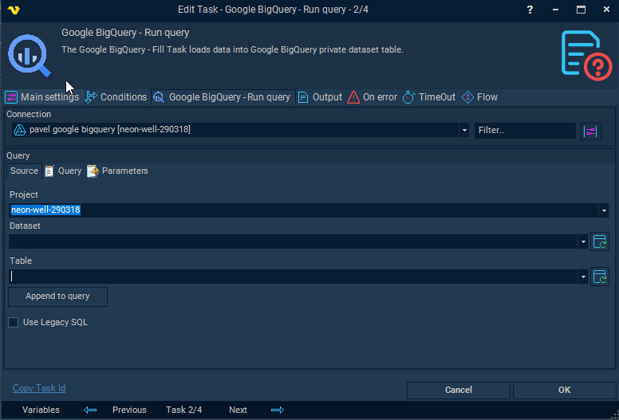

## Task Database - BigQuery - Run Query

The Google BigQuery - Query Task runs a query against Google BigQuery public or private dataset.
 
The BigQuery Tasks require the [Google Cloud Connection](connection-google-cloud).



This tab is just for browsing project from the connection and helps finding specific table and
append it’s fully qualified name to the Query window on the next page.
 
**Project**

This field can be project name from the selected connection or bigquery-public-data project for datasets available as public data.
 
**Dataset**

Datasets from the project specified. To refresh datasets press “Refresh datasets” button to the right.
 
**Table**

Tables from dataset specified. To refresh tables press “Refresh tables” button to the right.
 
:::info Note 

Dataset and Table fields are not saved when Task saves

:::

**Append to query**

This button creates initial query when Project, Dataset and Tables has been selected. The query is 

```SELECT * FROM `project.dataset.table` LIMIT 1000```
 
Use Legacy SQL
Turn on LegacySQL mode for the query when executing. When this setting is OFF - StandardSQL is being applied.