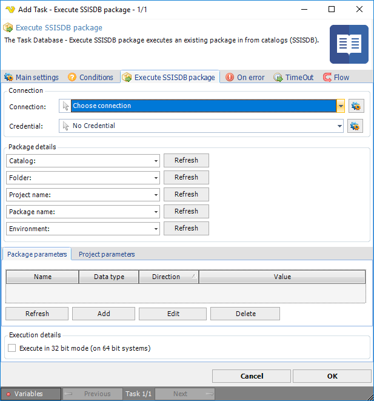

## Task Database - Execute SSISDB Package

The Task Database - Execute SSISDB package executes an existing package in from catalogs (SSISDB).
 
**Execute SSISDB package** tab

**Connection**

Text ...
 
**Credentials**

To control a remote computer you may need to use a Credential. The Credential must match the user name and password of the user that you want to login for. Select a Credential in the combo box or click the Settings icon to open Manage credentials in order to add or edit Credentials.
 
**Package details**

Text ...
 
**Package parameters**

Text ...