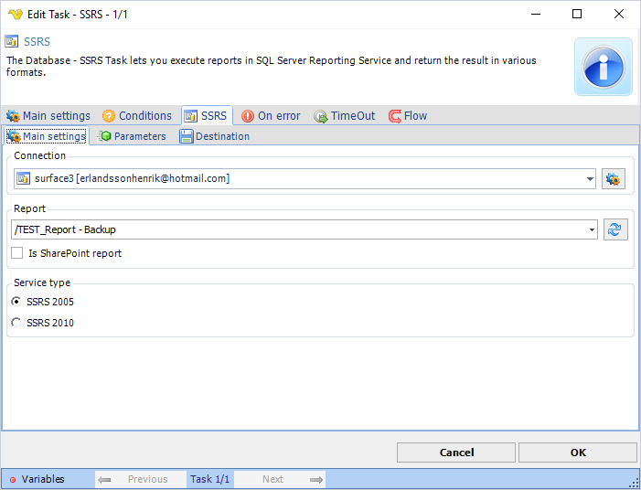
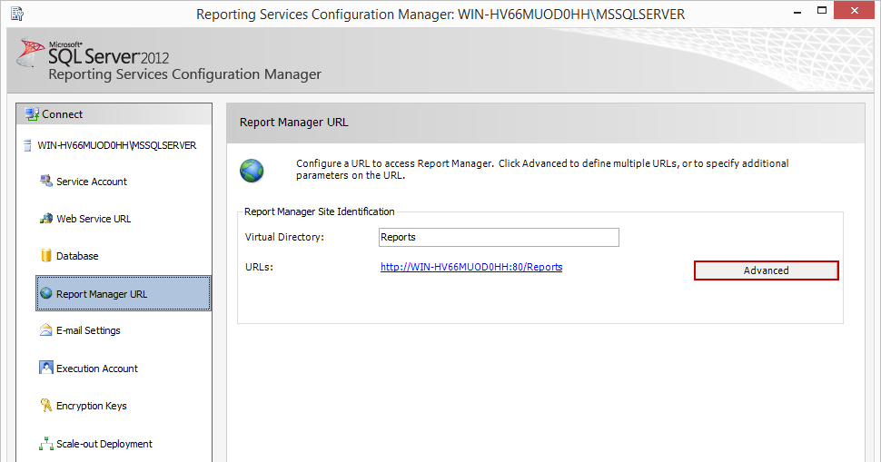
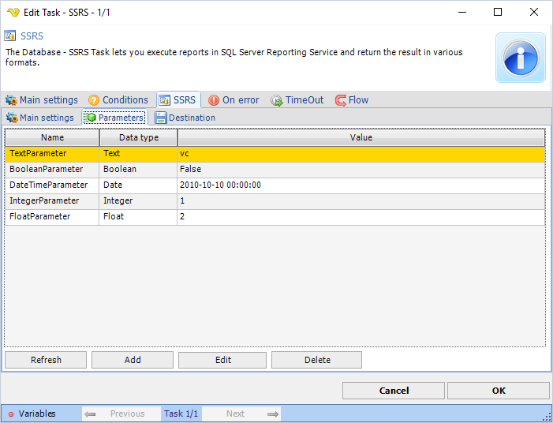
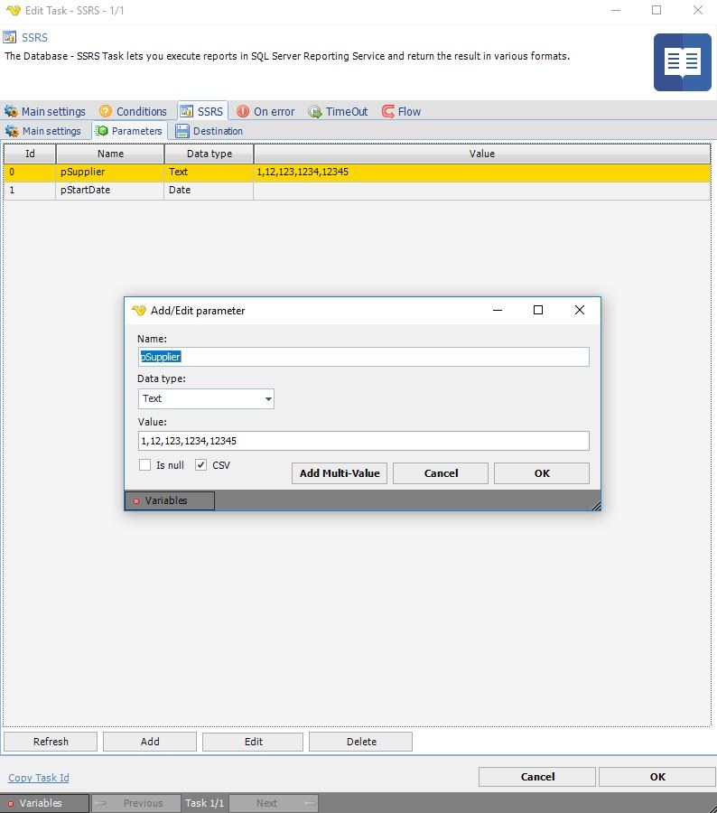
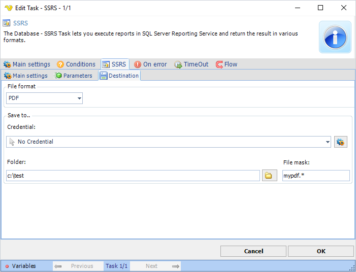

## Task Database - SSRS

The Database - SSRS Task lets you execute reports in SQL Server Reporting Services and return the result in various formats.
 
**SSRS > Main settings** sub tab



**Connection**

This Task type uses the global [SSRS Connection](connection-ssrs) type. Define username, password, host name and proxy in the [Connection](global-connections).
 
**Report**

Click Refresh to show the paths to all reports in the Reporting server. Select the path to an existing Report. You can find it in the *Reporting Services Configuration Manage*r under *Virtual Directory* here:



**Is SharePoint report**

This defines that the execution is related to a SharePoint report.
 
**Service type**

This describes what kind of service type the Reporting server uses. Use SSRS for SQL Server 2005.
 
**SSRS > Parameters** tab





Click Refresh to load all parameters for the selected Report path. Add/Edit the values supplied to each report. You can click *Add Multi-Value button* if you want to supply a range of parameters. Alternatively, use a comma separated list and click *CSV button*.

**SSRS > Destination** tab



**File format**

This is the output file format.
 
**Credential**

If you need to save to a network share you should use a Credential. Click the Settings icon to open the Manage credentials dialog.
 
**Folder**

Destination folder for the output file.
 
**File mask**

Any file mask (compared to the actual report name). Using * uses the report name + extension.
 
### Troubleshooting

**Exception in Task: System.Web.Services.Protocols.SoapException: You have attempted to use a rendering extension that is either not registered for this report server or it is not supported in this edition of Reporting Services**

Check the file rsreportserver.config in  ```c:\Program Files\Microsoft SQL Server\MSRS10_50.MSSQLSERVER_RS\Reporting Services\ReportServer```
 
The problem in our case is that via API we were requesting a report and attempting to convert the report from HTML to a different rendering extension. And, unfortunately, the specific Reporting Services instance’s configuration file has not been configured\extended to support the requested rendering format.
In MS SQL Server 2008-R2, the configuration file is located in a directory structure resembling the following:
 
```

 E:
   \Program Files
      \Microsoft SQL Server
         \MSRS10_50.MSSQLSERVER_RS
            \Reporting Services
               \ReportServer

```

In the configuration file, find the “Render” section:

```

< Configuration >
< Extensions >
< Render >

```

Within the Render section, find the corresponding “Extension” entry.
 
If your file format is HTML4 and you see the section try changing from name HTML4.0 to HTML4.