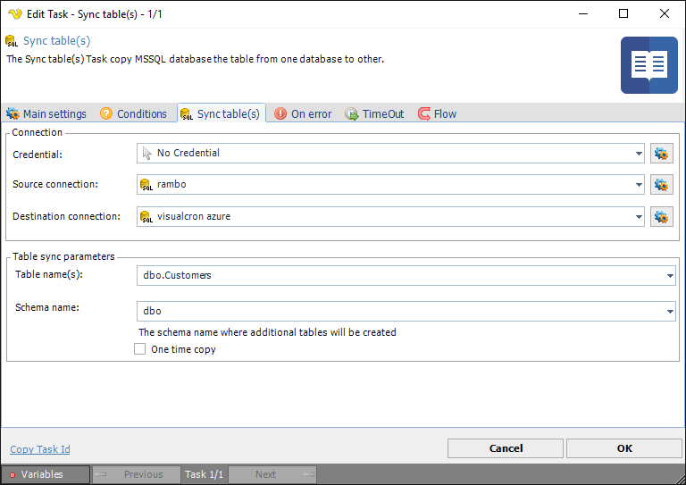

## Task Database - Sync Tables

The Database Sync tables Task synchronizes a database table from one database to another. This Task requires that you download the Microsoft Sync Framework from [here](https://www.microsoft.com/en-us/download/details.aspx?id=19502).
 
**Sync tables** tab



**Credential**

Specify a Credential that consists of the server name or IP address together with user name and password. Click the Settings icon to open the Manage credentials dialog.
 
**Source connection**

To use the Sync tables Task you need to create a [Source connection](global-connections) first. Click the Settings icon to open the Manage Connections dialog.
 
**Source connection**

To use the Sync tables Task you need to create a [Destination connection](global-connections) first. Click the Settings icon to open the Manage Connections dialog.
 
**Table copy parameters**

Enter Table name and Schema name for the table to be copied.
 
**One time copy**

If checked everything will be copied once. If not checked then Triggers will be installed at source to keep track of changes for the next run.
 
 
### Troubleshooting
 
**Retrieving the COM class factory for component with ```CLSID {EC413D66-6221-4EBB-AC55-4900FB321011}``` failed due to the following error: 80040154 Class not registered (Exception from ```HRESULT: 0x80040154 (REGDB_E_CLASSNOTREG```))., Retrieving the COM class factory for component with ```CLSID {EC413D66-6221-4EBB-AC55-4900FB321011}```**

Install the Microsoft Sync Framework. See link on top of this page.