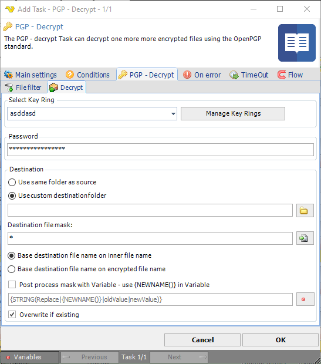

## Task Encrpytion - PGP Decrypt

The PGP - decrypt Task can decrypt one more more encrypted files using the OpenPGP standard.
 
General [PGP information](global-pgp-key-rings) is available.
 
**PGP decrypt > File filter > Location** sub tab
In the File filter tab you define which files should be decrypted. Read more about file filter [here](job-tasks-file-filter).
 
**PGP decrypt > Decrypt** sub tab



**Select key ring**

Select a key ring that contains the key that should be used for decryption.
 
**Password**

If the file is encrypted with a password then enter the password here.
 
**Use same folder as source**

The decrypted file will be placed in the same folder as were the original encrypted file was found.
 
**Use custom destination folder**

If the destination file name should be changed in some way then you can enter a new file mask for this here. Default "`*.*`" keeps the same original name.
 
**Destination file mask**

You can use a wild card to replace the original name. For example `*.pdf` keeps the original name but changes the extension to "pdf". You can use `?` and `*` as wild card characters. `?` replaces/matches a single letter.
 
**Base destination file name on inner file name/Base destination file name on encrypted file name**

Encrypted PGP files have an inner name that is set by encrypting tool. Normally, that name is the original file name. Sometimes it is different depending on tool. With this option you can choose if you want destination file mask and post process features to be based on the original name inside the pgp file or the encrypted file (the source, encrypted file).
 
**Post process mask with Variable**

Sometimes you might want to change the name with the help of a Variable. Use default `*` in the New name mask and then check this box to add support for Variable renaming.
 
The default value shows how to use this property. ```{STRING(Replace|{NEWNAME()}|oldValue|newValue)}. {NEWNAME()}``` is the new name after the New name mask has been processed. You need this Variable pointer to find the "current" name you want to rename.
 
**Overwrite if existing**

If the destination file already exists it will be overwritten - otherwise nothing will happen.
 
Key rings are managed in the *PGP -> Recipients* or the *PGP -> Signers* tabs by clicking on Manage Key Rings button. In the Manage PGP Key Ring window, click on the Add button to open the *Add PGP Key Ring* window. More information is available for [manage PGP key rings](global-pgp-key-rings).
 
 
### Troubleshooting
 
**OpenPGP secret key for decryption found**

This means that no PGP key, of OpenPGP key format, exists in the VisualCron key ring. Try importing it again.
 
**No appropriate OpenPGP secret key for decryption found**

This means that the selected PGP key ring does not contain the private key that is used for decryption.