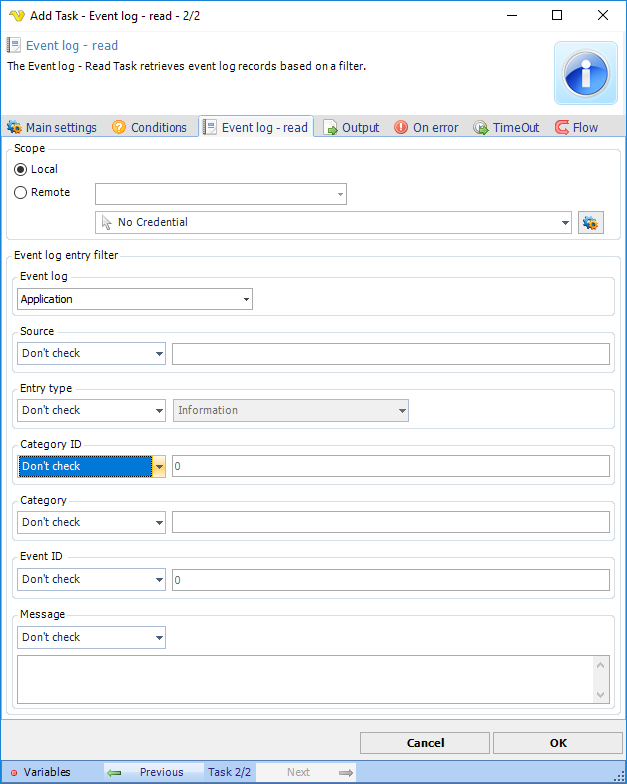

## Task Event Log - Event Log Read

The Event log Read Task retrieves event log records based on a filter.

**Credentials**

To control a remote computer you may need to use a Credential. The Credential must match the user name and pass word of the user that you want to login. Click on *Manage credentials* to add or edit Credentials. Select a Credential in the combo box.
 
**Local or Remote**

Select the the *Local* radio button if you want to control the local computer, select the *Remote* radio button if you want to control a remote computer.
 
**Hostname**

The name of the remote computer.
 
**Event log entry filter**

Text ...