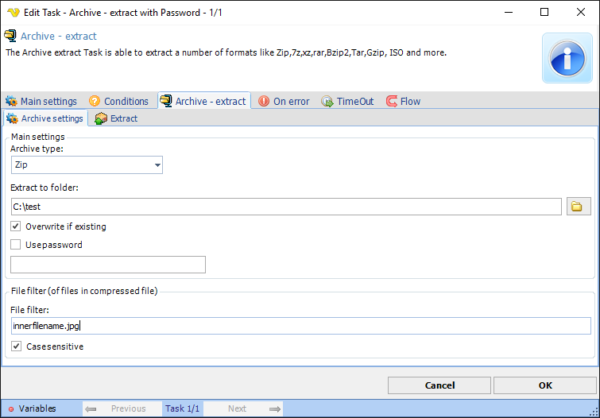
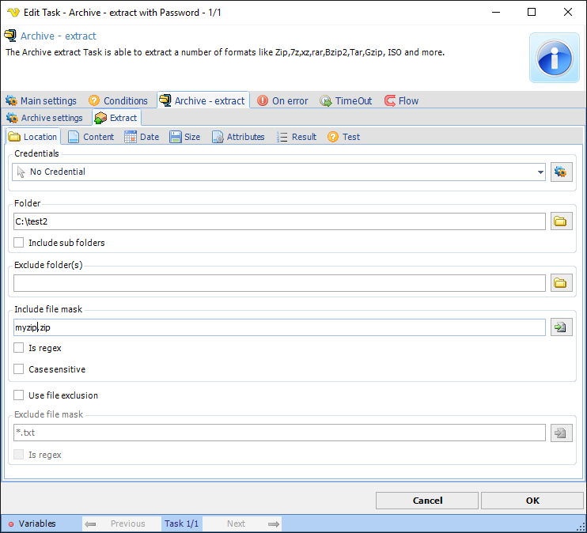

## Task File - Archive - Extract

The Archive extract Task is able to extract a number of formats like Zip,7z,Xz,Rar, Bzip2,Tar, GZip, ISO and more.

:::note Enabling NTFS long paths in Windows
 
By default, the [maximum path length limit in Windows](https://learn.microsoft.com/en-us/windows/win32/fileio/maximum-file-path-limitation?tabs=registry) is 260 characters. However, it is possible to remove the limitation on Windows 10 (v. 1607 or later) so that VisualCron will support the paths that are longer than 260 characters. In the context of the current Task, this feature allows to archive files within folders of unlimited depth, ensuring correct extraction at any nesting level of the target folder.
The short instruction to allow accessing paths beyond the 260 characters limit:
 
**Filesystem Registry entry (Windows Home)**
 
* Press Win + R keys on your keyboard and type regedit then press Enter. Registry Editor will be opened.
* Go to `HKEY_LOCAL_MACHINE\SYSTEM\CurrentControlSet\Control\FileSystem`.
* Create a new 32-bit DWORD value named LongPathsEnabled and set it to 1.
* Restart  Windows.
 
**Using Group Policy (Windows Pro and Enterprise (Windows Server 2016 or above))**
 
* Press Win + R keys on your keyboard and type gpedit.msc then press Enter. Group Policy Editor will be opened.
* Go to Local Computer Policy -> Computer Configuration -> Administrative Templates -> System -> Filesystem, then enable the Enable Win32 long paths option.
* Restart Windows.

:::

When the *Archive - extract* Task is selected in the Task window you are presented with a set of sub tabs within the Archive - extract tab.

**Archive type**

Select any of the supported archive types.
 
**Extract to folder**

Select which folder you want to extract the zip file(s) to.
 
**Overwrite if existing**

If checked, VisualCron will attempt to overwrite any existing files (from the zip folder).
 
**Use password**

If checked you are able to specify a password for the zip file.
 
**File filter**

A string that can include wild cards that control which inner files to extract. Split multiple entries with semicolon.
 
**Case sensitive**

If the file filter string should be case sensitive.
 
**Archive - extract > Extract > Location** sub tab

The extract tab contains the [file filter](job-tasks-file-filter) that is used to find zip files for extraction.

