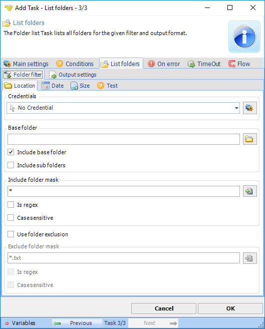
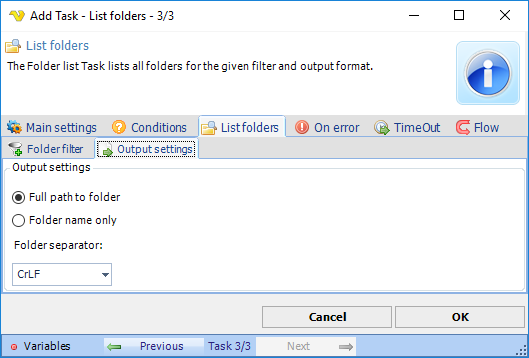

## Task File - List Folders

The File - List folder Task lists all folders for the given filter and output format.

This Task is using the standard VisualCron [Folder filter](job-tasks-folder-filter) to find one or more folders.
 
**List folders > Output settings** sub tab

**Output settings**

List file settings includes folder path and folder separator options.