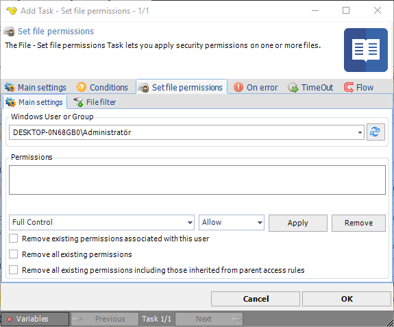

## Task File - Set File Permissions

The File - Set file permissions Task lets you apply security permissions for one or more  files.

**Windows User or Group**

Enter or click Refresh button to fill a list of users and groups.
 
**Permissions**

Add permissions you want to set for the files.
 
**Folder processing options**

Determines if folder, files or both should be affected by the new permissions.
 
**Remove existing permissions associated with this user**

Removes all existing permissions associated with the selected user.
 
**Remove all existing permissions**

Removes all existing permissions.
 
**Remove all existing permissions including those inherited from parent access rules**

Removes all existing permissions including those inherited from parent access rules.
 
**Set file permissions > File filter > Location** sub tab

This Task uses the standard VisualCron [File filter](job-tasks-file-filter) to filter out files to set permissions for.

