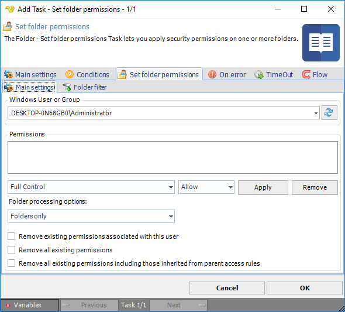

## Task File - Set Folder Permissions

The Folder - Set folder permissions Task lets you apply security permissions on one or more folders.

**Windows User or Group**

Enter or click Refresh button to fill a list of users and groups.
 
**Permissions**

Add permissions you want to set for the folders.
 
**Folder processing options**

Determines if folder, files or both should be affected by the new permissions.
 
**Remove existing permissions associated with this user**

Removes all existing permissions associated with the selected user.
 
**Remove all existing permissions**

Removes all existing permissions.
 
**Remove all existing permissions including those inherited from parent access rules**

Removes all existing permissions including those inherited from parent access rules.
 
**Set folder permissions > Folder filter > Location** sub tab

This Task uses the standard VisualCron [Folder filter](job-tasks-folder-filter) to filter out folders.