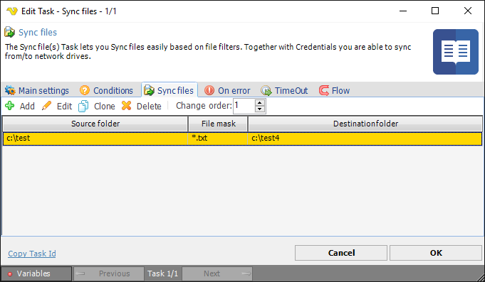
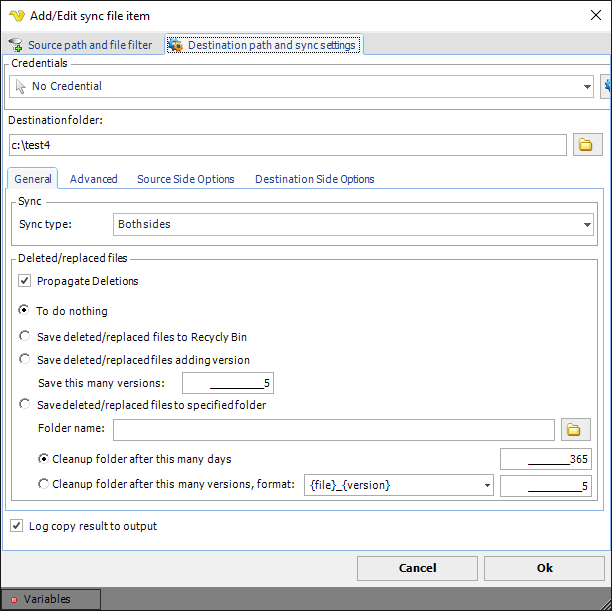
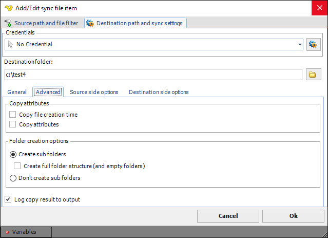
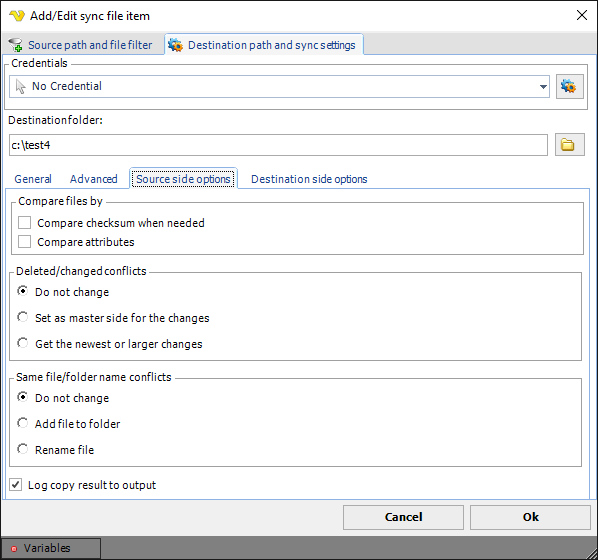
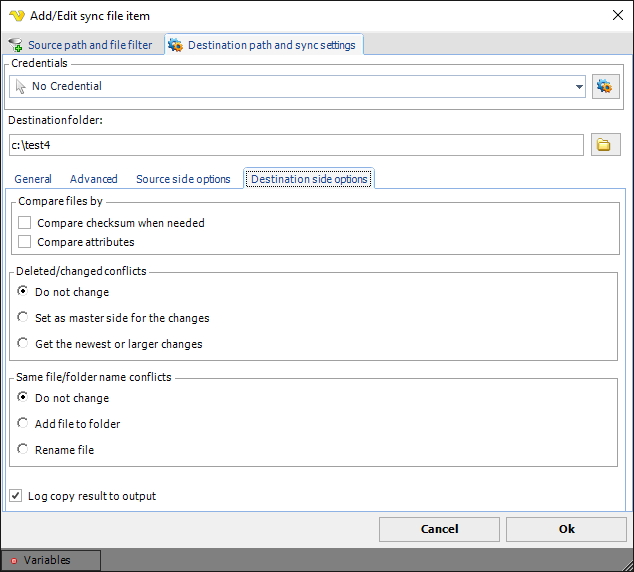

## Task File - Sync

The Task file - Sync files Task lets you sync files between two folders according to some file filters.
 
Multiple sync file items

You can add one or more file sync items in this Task.
 
 
**Add file sync item->Source path and file filter** tab

Use the regular [file filter](job-tasks-file-filter) to filter what kind of files you want to sync.
 
 
**Add file sync item->Destination path and sync settings** tab

**Credential**

To access a remote computer you may need to use a [Credential](global-credentials). Normally that Credential is a remote or AD user with "Local logon" unchecked. The Credential must match the user name and password of the user that you want to login for. Select a Credential in the combo box or click the *Settings* icon to open *Manage credentials* in order to add or edit Credentials. This Credential is used to access the destination directory.
 
 
**Destination folder**

Specify a absolute path to the directory you want to sync between.
 
 
**Destination->General** tab
 
**Sync type**

Both sides - this option allows mirroring of files against two folders according to the current file filter.
 
 
**Propagate deletions**

If in one side the file is deleted - on the other side:

1. do nothing (the file remains)
2. delete file to trash
3. rename the deleted file by adding the version number to the name, the number of file versions in the directory is controlled
4. move the deleted file to the specified folder, manage the cleaning of the folder by the number of days or by file version numbers, the file rename format is set in the field, the current keywords are " `{file}`
" and "
`{version}`
", the first is replaced by the current name, the second is replaced with the version number, if the number of versions is exceeded, the previous versions of the files are renamed with the lower version number.
 
 
**Destination->Advanced** tab

**Copy attributes->Copy file creation time**

If the creation time of the file should be synced over
 
**Copy attributes->Copy attributes**

If file attributes should be synced over
 
**Folder creation options->Create sub folders**

Create sub folders when needed.
 
**Folder creation options->Create full folder structure**

Create full folder structure including empty folders.
 
**Folder creation options->Don't create sub folders**

Do not create any sub folders (sync to base folder).
 
 
**Destination->Source side options** tab

**Compare files by->Compare checksum when needed**

If the files are identical in length and the date of the last change, then compare the checksum of the contents of the files
 
**Compare files by->Compare attributes**

If the files are identical in length, modification date and content, then compare attributes
 
**Deleted/changed conflicts->Do not change**

Do nothing - do not change the situation.
 
**Deleted/changed conflicts->Set as master side for the changes**

When changes are detected on the other side - do not apply changes to this side
 
**Deleted/changed conflicts->Get the newest or larger changes**

If changes are detected on the other side, update the files if they are on the other side newer or larger
 
**Same file/folder name conflicts->Do not change**

Do not change the situation.
 
**Same file/folder name conflicts->Add file to folder**

If a directory on this side is found whose name coincides with the file name on the other hand - copy the file to this directory.
 
**Same file/folder name conflicts->Rename file**

When a directory on this side is found whose name matches the file name on the other side - copy the file with a new name.
 
**Destination->Destination side options **tab

**Compare files by->Compare checksum when needed**

Ff the files are identical in length and the date of the last change, then compare the checksum of the contents of the files
 
**Compare files by->Compare attributes**

If the files are identical in length, modification date and content, then compare attributes
 
**Deleted/changed conflicts->Do not change**

Do nothing - do not change the situation.
 
**Deleted/changed conflicts->Set as master side for the changes**

When changes are detected on the other side - do not apply changes to this side
 
**Deleted/changed conflicts->Get the newest or larger changes**

If changes are detected on the other side, update the files if they are on the other side newer or larger
 
**Same file/folder name conflicts->Do not change**

Do not change the situation.
 
**Same file/folder name conflicts->Add file to folder**

If a directory on this side is found whose name coincides with the file name on the other hand - copy the file to this directory.
 
**Same file/folder name conflicts->Rename file**

When a directory on this side is found whose name matches the file name on the other side - copy the file with a new name.
 
**Log copy result to output**

When this setting is checked, the result, source and destination file is added to the Task output. All files that are copied is added to the output.

