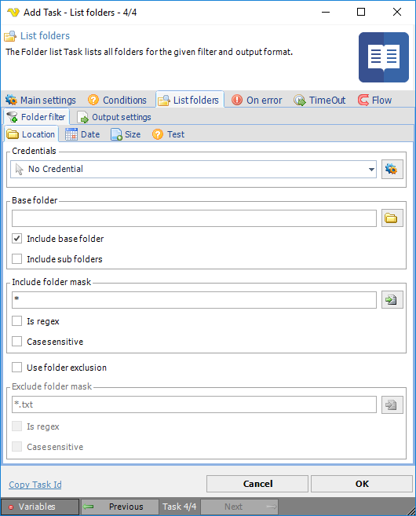
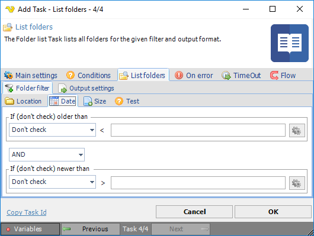
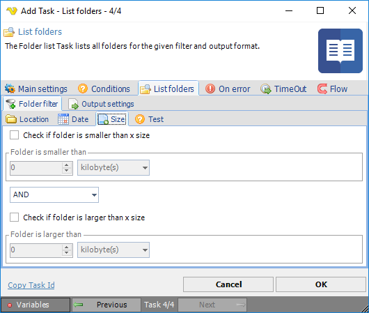
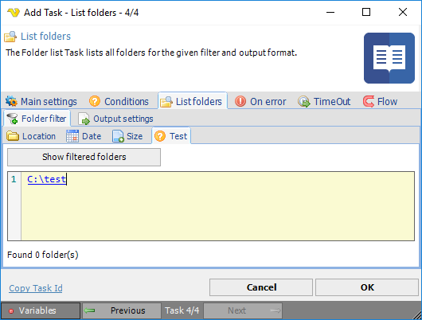

## Remote Folder Filter

The folder filter is similar to the file filter but filters out folders only. It is used in various Tasks.
 
**Folder filter > Location** sub tab

**Credentials**

To control a remote computer you may need to use a Credential. Normally that Credential is a remote or AD user with "Local logon" unchecked The Credential must match the user name and password of the user that you want to login for. Select a Credential in the combo box or click the Settings icon to open Manage credentials in order to add or edit Credentials.
 
**Base folder**

Where the search filter should start finding folders. Click the Folder icon to browse the folder tree.
 
**Include base folder**

If the base folder should be included in the result.
 
**Include sub folders**

If sub folders of the base folder should be included in the result.
 
**Include folder mask**

Wild card for filtering out folder names. Separate multiple folder names with semicolon ";" like this: C:\Temp;C:\test. Click the Folder icon to browse for files.
 
**Is regex**

If the include folder mask is a regular expression
 
**Case sensitive**

If case sensitive search should be done on the include folder mask.
 
**Folder filter > Date** sub tab

There are two types of checks *Older than* and *Newer than*. These can be combined with AND/OR or used separately. Only date variables can be used here. Once you have selected a Variable it can be previewed when hovering over text box (tool tip) or in the group caption.
 
Click on the *Variables* icons to view and select available Date Variables.
 
**Folder filter > Size** sub tab

**Check if folder is smaller than x size**

Select this to enable size checking. Enter a value in the numeric text box and select the size unit to compare with. Default is kilobyte(s). If the size on the folder is smaller than the value you enter in the numeric box it will return true (=folder will be included).
 
**Check if folder is larger than x size**

Select this to enable size checking. Enter a value in the numeric text box and select the size unit to compare with. Default is kilobyte(s). If the size on the folder is larger than the value you enter in the numeric box it will return true (=file folder be included).
 
**Folder filter > Test** sub tab

**Show filtered folders**

The test will use the selected Credential and lets you test your folder filter - what folders it returns based on the filter.