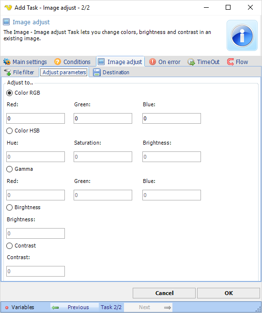
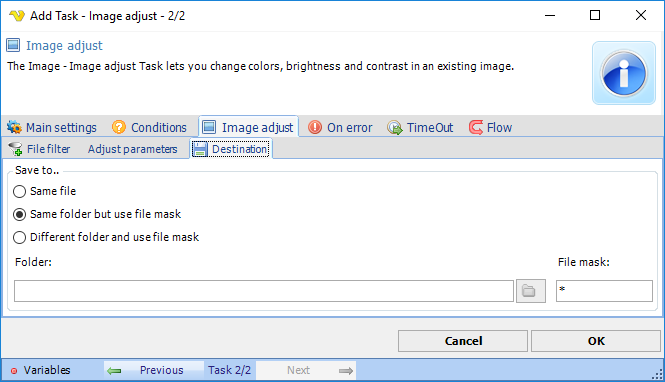

## Task Image - Adjust

The Image adjust Task lets you change colors, brightness and contrast in an existing image.
 
**Image adjust > File filter > Location** sub tab

In the File filter tab you define the image file to be adjusted. Read more about file filter [here](job-tasks-file-filter).
 
**Image adjust > Adjust parameters** sub tab

**Adjust to**

All image adjust values are set to 0 by default. For RGB and Gamma, select a value between 0 and 255 to intense a red, green or blue color.
 
**Image adjust > Destination** sub tab

**Save to**

Enter destination file and folder names.
 
**Folder**

If *Different folder and use file mask* is selected, use manual folder specification or click the *Folder* icon.
 
**File mask**

Save file with different name.
