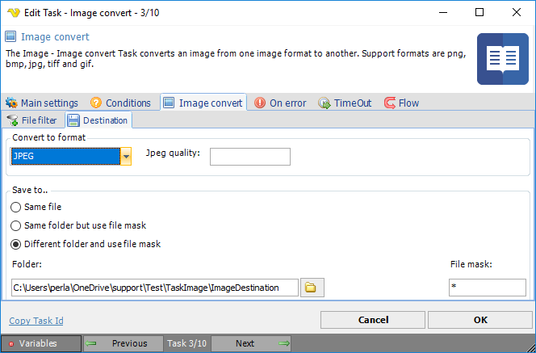

## Task Image - Convert

The Image convert Task converts an image from one format to another. Supported formats are png, bmp, jpg, tiff and gif.
 
**Image convert > File filter > Location** sub tab
In the File filter tab you define the image file to be converted. Read more about file filter here.
 
**Image convert > Destination** sub tab

**Convert to format**

Destination image format. If JPEG, optionally select JPEG quality.
 
**Save to**

The destination folder and file mask which the image is saved to.
 
**Folder**

If Different folder and use file mask is selected, use manual folder specification or click the Folder icon.
 
**File mask**

Save file with different name.

