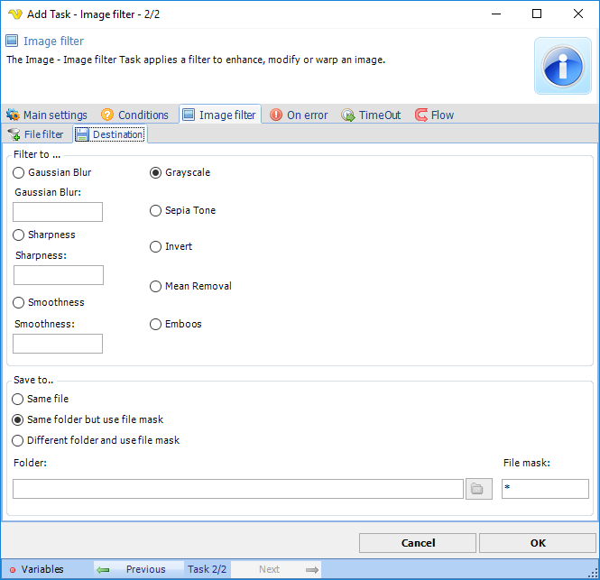

## Task Image - Filter

The Image filter Task applies a filter to enhance, modify or warp an image.
 
**Image filter > File filter > Location** sub tab
In the File filter tab you define which image that should be filtered. Read more about [file filter](job-tasks-file-filter) here.
 
**Image filter > Destination** sub tab

**Filter to**

More or less gently modifies the source image to be blurred, sharpened or smoothed. Gaussian blur is the result of blurring an image, typically to reduce image noise and reduce detail.
More aggressive modification of the source image to Grayscale, Sepia  Tone, Invert, Mean removal and Emboss
 
**Save to**

The destination folder and file mask which the image is saved to.
 
**Folder**

If Different folder and use file mask is selected, use manual folder specification or click the Folder icon.
 
**File mask**

Save file with different name.