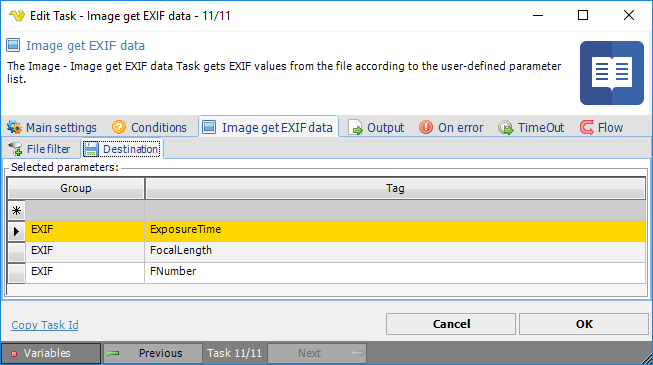

## Task Image - Get EXIF Data

The Image get EXIF data Task gets EXIF values from the file according to the user-defined parameter list.
 
**Image get EXIF data > File filter > Location** sub tab
In the File filter tab you define the image file to be checked for EXIF data. Read more about file filter [here](job-tasks-file-filter).
 
**Image get EXIF data > Destination** sub tab

Click on the "star" icon to add a new parameter row. Then use the drop-down list to select a group and finally the right-most drop-down list to select a tag. A defined parameter line is deleted by marking the line and the press the PC *Del* button.
 
If the desired tag doesn't exist in the drop-down tag list, it is possible to add a new value using an integer. This solves an issue e.g. based on a new value which has not yet been included the tag list.