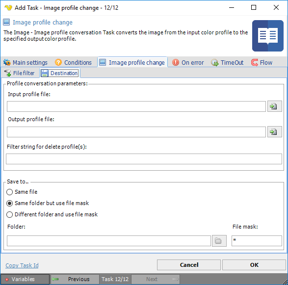

## Task Image - Profile Conversion

The Image profile conversion Task converts the image from the input color profile to the specified output color profile.
 
**Image profile conversion > File filter > Location** sub tab
In the File filter tab you define the image file to change the profile for. Read more about file filter [here](job-tasks-file-filter).
 
**Image profile conversion > Destination** sub tab

**Input profile file**

The current profile name of the input file.
 
**Output profile file**

The profile name to be applied to the output file.
 
**Filter string for delete profile(s)**

Text ...
 
**Save to**

Enter destination file and folder names.
 
**Folder**

If *Different folder and use file mask* is selected, use manual folder specification or click the Folder icon.
 
**File mask**

Save file with different name.