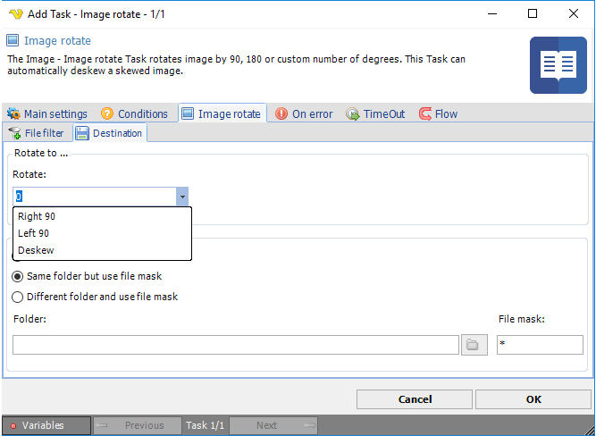

## Task Image - Rotate

The Image rotate Task rotates an image by 90, 180 or a custom number of degrees. This Task can automatically deskew a skewed image.
 
**Image rotate > File filter > Location** sub tab

In the File filter tab you define which image that should be rotated. Read more about file filter [here](job-tasks-file-filter).
 
**Image rotate > Destination** sub tab

**Rotate to**

Select Rotate Right/Left 90 ° or custom value.
 
**Save to**

The destination folder and file mask which the image is saved to.
 
**Folder**

If *Different folder and use file mask* is selected, use manual folder specification or click the *Folder* icon.
 
**File mask**

Save file with different name.