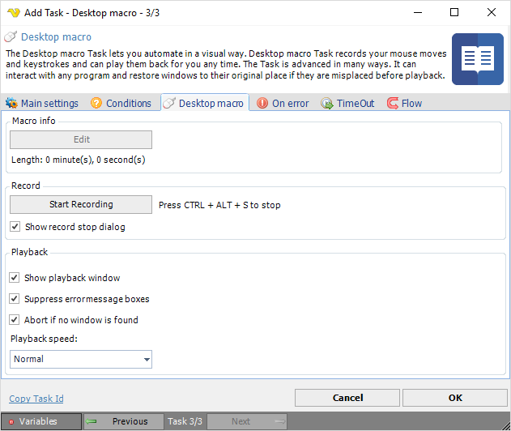

## Task Interactivity - Desktop Macro

This Task is obsolete. Please use the [Robot Task](job-tasks-interactivity-tasks-task-interactivity-robot-task).
 
The Desktop macro Task lets you automate in a visual way. Desktop macro Task *records* your mouse moves and keystrokes and can *play them back* for you any time. The Task is advanced in many ways. It can interact with any program and restore windows to their original place if they are misplaced before playback.
 
There are many uses for the Desktop macro Task, for example:

* web automation
* testing
* automate manual Tasks
* excel interaction
 
The Desktop macro Task is dependent on access to the desktop. Mouse moves and keystrokes must have a desktop to playback onto. To accomplish this, as the [VisualCron Server](visualcron-server) is running as a service the [VisualCron Tray Client](visualcron-tray-client) is used for playback. This means also that the Task can only be run as a [foreground Task](task-main-settings-execution-context).

**Edit**

This feature is currently unavailable but will let you edit mouse moves, key strokes in detail. Please let us know if you find this an important feature and we will prioritize it.
 
**Length**

Displays the playback length of the macro when played back with *normal speed*.
 
**Start Recording**

Minimizes the VisualCron windows and starts the recording. You can interrupt this any time by clicking CTRL + ALT + S or if you click on Stop button on Record dialog. During record you perform the steps which you want VisualCron to do later. One tip could be to take things slowly as the time it may take to open a program/window may vary.
 
**Show record stop dialog**

If this is property is unchecked you will not see the window with the Stop button. To stop recording you must press CTRL + ALT + S.
 
**Show playback window**

If this property is unchecked the playback popup will not be shown.
 
**Suppress error message boxes**

If this property is checked no message boxes will halt the application if a certain window is not found during playback.
 
**Abort if no window is found**

If this property is checked it forces the Task to abort when a certain window is not found.
 
**Playback speed**

The Desktop macro Task has 3 playback speeds:

1. **Normal** - plays back with the same speed as you recorded it
2. **High** - plays back with the double speed
3. **Ultra** - plays back with zero waiting time on mouse moves