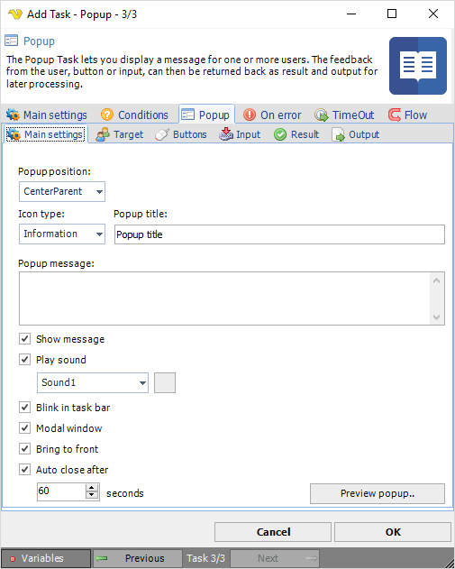

## Task Interactivity - Popup

The Popup Task lets you display a message for one or more users. The feedback from the user, button or input, can then be returned back as a result and output for later processing.
 
The Popup Task has a number of purposes:

* Display a simple message
* Display a message and return input in form of buttons
* Display a message and return input in form of text boxes, radio boxes and other controls
 
The actual controls can return user defined values and the result of values can control the result of the Task.
 
**Sample popup**

**Popup > Main settings** sub tab

**Popup position**

Where the popup window is displayed.
 
**Icon**

The icon that is displayed next to the Message
 
**Title**

Title within the popup.
 
**Message**

*(Optional)* - the actual message or description that is shown
 
**Show message**

If the message should be displayed.
 
**Play sound**

You are able to select among a set of predefined sounds to play when window opens.
 
**Blink in task bar**

This makes the item in task bar blinking.
 
**Modal window**

This controls if the window should block other windows in the same application.
 
**Bring to front**

Display the Window top most.
 
**Auto close after**

You need to specify a timeout time for this popup message. This controls when the popup is auto-closed. When auto closing the dialog result is "Cancel".
 
**Preview popup**

Click this button to test the popup.
 
**Popup > Target** sub tab

Right now the Popup can be sent to single user(s), specified groups or the user that executes the Task/Job.
 
**Popup > Buttons** sub tab

You are able to select among common buttons for the popup. In the Result tab you can control how the press of a specific button affect the result of the Task. In the Output tab you control if the button value should be returned as output or if the Input should be returned.
 
You may also set the value that is returned for the specific button.

**Popup > Input** sub tab

The Input tab controls optional input control that you can use. For example if you want the user to input text or select a radio button, checkbox or combobox. If you want the output from the input control you need to change behavior in the Output tab.
 
You can also use a Variable source as input.
 
**Caption**

Use any Variable or text that contains a separation according to *input separator*. If you want the caption to be based on the value then check *Use value as caption*.
 
**Value**

Use any Variable or text that contains a separation according to *input separator*. The value property is what is returned when selecting an item.
 
**Use value as caption**

Value array will be used in caption array. Useful if you cannot or don't want to map caption to array (maybe only once source available).
 
**Input separator**

This is the type of character that seprates each value.
 
**Mask input**

If you want to display textbox that user supplies a password to for example.
 
**Sort alphabetically**

If checked, items are sorted alphabetically, otherwise in the order they are supplied.
 
You can add input controls by pressing the Add button.

**Popup > Result** sub tab

The Result tab controls the result of the Task (if it should fail or not) depending on what you select, write or click.
 
When adding or editing a "Popup Result" you are able to control what happens if, for example, the radio button is checked.

**Popup > Output** sub tab

In the output settings you control what is returned from the Task. By default the Button value is returned *(Dialog result)* but you can also return input values in output *(Input values)*. When choosing input option "checkbox" each value will be returned in a new row.
 
**Include caption**

The Caption property is put in front of value like "captionvalue=inputvalue" when this option is checked.