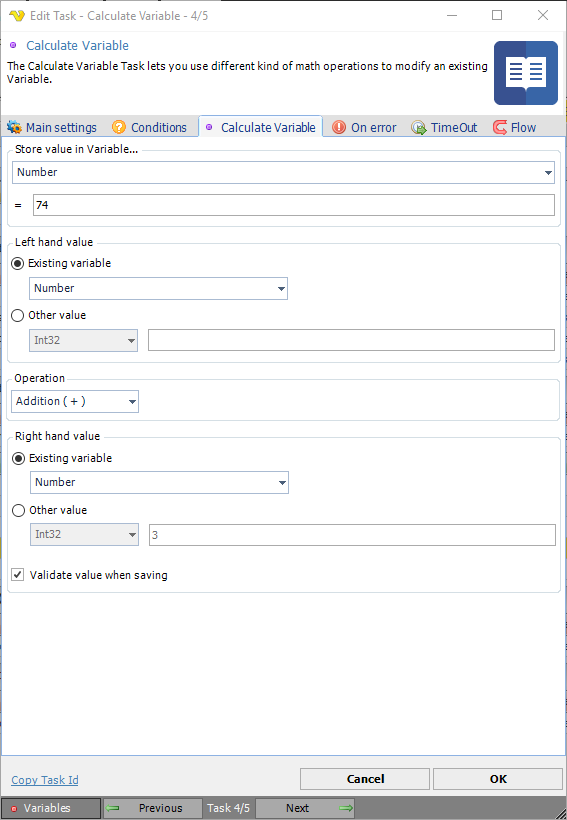

## Task Internal - Calculate Variable

The Calculate Variable Task lets you use different kind of math operations to modify and existing Variable.

**Store value in Variable...**

First you select an existing Variable to store the new value in.
 
**Result box**

Here you can preview the future value of the next calculation.
 
**Left and right hand value**

You can choose to either work with the current Variable, one or two other Variables or just two other values. By combining different settings you have the following choices:

* VariableX = VariableY (math operation) VariableZ
* VariableX = VariableX (math operation) Value1
* VariableX = VariableY (math operation) Value1
* VariableX = Value1 (math operation) VariableX
* VariableX = Value1 (math operation) VariableY
* VariableX = Value1 (math operation) Value2
 
**Operation**

The following math operations are available: Addition, Subtraction, Multiplication and Division
 
**Validate value when saving**

If checked, VisualCron will validate the value with the value type. Leave not checked if you are using a Variable as value and the Variable is not yet set.