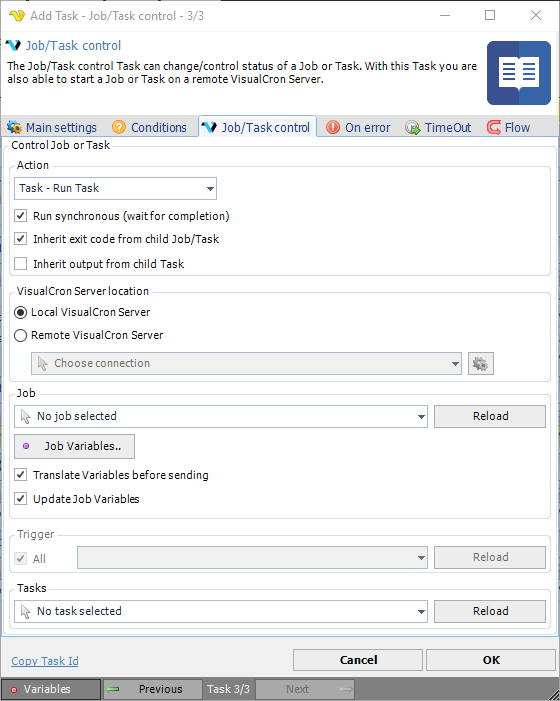

## Task Internal - Job/Task Control

The Job/Task control can change/control status of a Job or Task. With this Task you are also able to start a Job or Task on a remote VisualCron Server.
 
The VisualCron Task uses the [VisualCron Connection](connection-visualcron) when you want to control a remote server.

**Action**

Select the appropriate Action. The following actions exist:

* **Run Job** - Starts a Job
* **Stop Job** - Stops a running Job
* **Activate Job** - Sets a Job to Active
* **Inactivate Job** - Inactivates a Job
* **Run Task** - Starts a Task
* **Stop Task** - Stops a Task
* **Activate Task** - Sets a Task to Active
* **Inactivate Task** - Sets a Task to Inactive
 
**Run synchronous**

Waits for Job or Task completion before continuing to next Task.
 
**Inherit exit code from child Job/Task**

By default the result from the Job/Task is inherited (sent back) to this Task. So, if the Task or Job you are trying to run fail with another exit code than zero then that exit code will be inherited by this Task - and also fail.
 
**Inherit output from child Task**

By default, output from the Task you want to run will not be send back to this Task. But if you want it to be sent back you can check this box.
 
**Local/Remote server**

You are able to execute a Job/Task located on a remote Server (where VisualCron is installed). To do that you select Remote server and then choose a *VisualCron Connection*.
 
**Reload (Jobs)**

Press this button to populate the Job list.
 
**Job Variables**

Job Variables are covered [here](job-variables). In this Task you can pass values at execution. If the keys are the same as the existing in the Job they existing Job Variables will be overwritten. One difference in the Job Variables window is that you have the option to refresh/load existing Job Variables. Click on the *Get current Variables* button and they will be refreshed (any existing Variables with same keys in the Task will be overwritten).
 
**Translate Variables before sending**

Checking this produces the same behavior as when you check similar on Set Variable Task - the Variable becomes a constant.
 
**Update Job Variables**

When enabled, the target Job Variables will be updated with the Variables supplied here.
 
**Reload (Triggers)**

Press this button to populate the Trigger list.
 
**Reload (Tasks)**

Press this button to populate the Task list.
 
:::tip Note

The execution timeout of this Task is determined first by settings in the Timeout tab. If no settings are used, the timeout on the Connection (in this case VisualCron Connection) is used.

:::