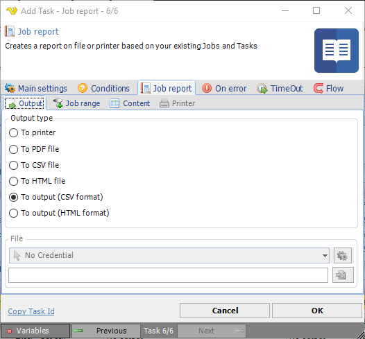
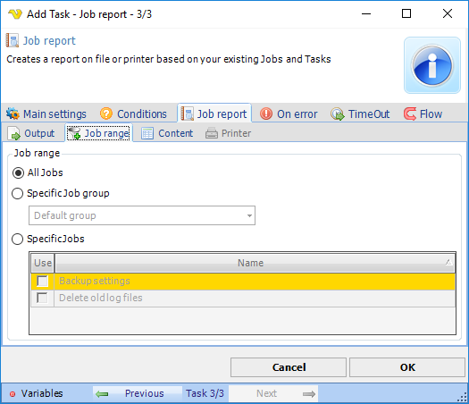
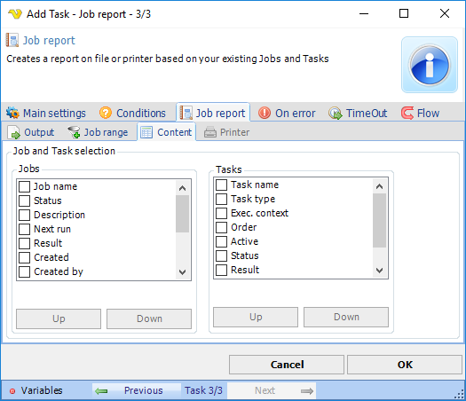
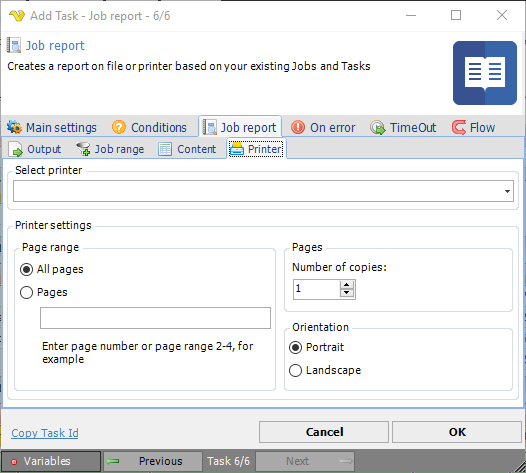

## Task Internal - Report

The Task Internal - Report Task creates a comprehensive report in a file or on a printer based on the execution statistics of Jobs and Tasks, settings and events of various Server Objects, performance metrics, log entries, and other relevant data sources.
 
**Report > Output** sub tab

**Output type**

Select output to printer, to file or standard (Task) output.
 
**File**

If output to file, select Credentials and output folder.
 
**Internal > Report > Job range** sub tab

**Job range**

Select output of all Jobs or narrow down to specific Jobs.
 
**Internal > Report > Content** sub tab

**Job and Task column selection**

Select which properties of a Job and Task will appear in the report.
 
**Internal > Report > Printer** sub tab

If output to printer is selected in the **Report > Output** sub tab, select printer settings.