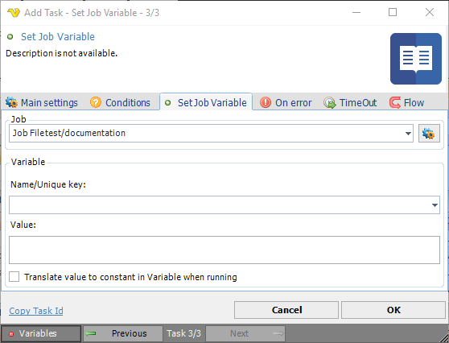

## Task Internal - Set Job Variable

The Set Variable Task allows you to create or update a Variable. Variables can be used and reached throughout the whole application. You can use this to store static or dynamic values.
 
A Job variable is related to a job, thus when that specific job is exported, the Job variable is included.

**Job**

List of defined jobs.
 
**Name/Unique key**

The name you set on the Variable is also the unique key for the Variable. Wherever you want to use your defined Variable you use this Variable key: {USERVAR(variablename)}
 
**Value**

Set the requested value of the Variable here
 
**Translate value to constant in Variable when running**

Optional. If you, for example, use a Date Variable in the "Variable value" text box the Variable will be converted to a string when the Variable runs the first time - if not, the Variable keep the reference to the Variable. For example, if you use the current date as a Variable it will always show the current date when running in another Task (if unchecked). If this is checked, it will show the value of the date - from the last time the Variable was set.