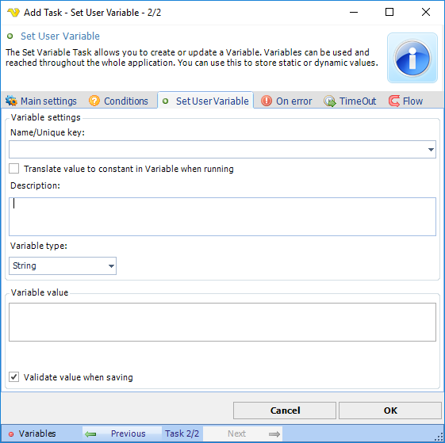
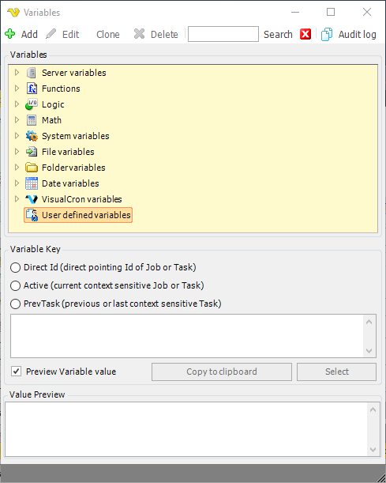
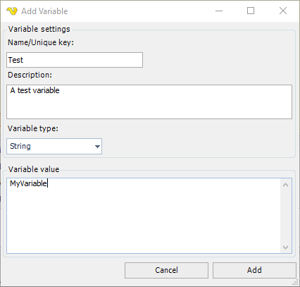

## Task Internal - Set User Variable

The Set Variable Task allows you to create or update a Variable. Variables can be used and reached throughout the whole application. You can this to store static or dynamic variables.
 
A User Variable is only global, which enables use anywhere in the application.

**Name/Unique key**

The name you set on the Variable is also the unique key for the Variable. Wherever you want to use your defined Variable you use this Variable key: {USERVAR(variablename)}
 
**Translate value to constant in Variable when running**

Optional. If you, for example, use a Date Variable in the "Variable value" text box the Variable will be converted to a string when the Variable runs the first time - if not, the Variable keep the reference to the Variable. For example, if you use the current date as a Variable it will always show the current date when running in another Task (if unchecked). If this is checked, it will show the value of the date - from the last time the Variable was set.
 
**Description**

Optional. If you want to distinguish your Variable further you can add a description.
 
**Variable type**

Currently, 3 Variable types exist. String, Int32 and Double. Note that the Variable type may be interested to set correctly if you want to compare/calculate/validate correctly.
 
**Variable value**

Set the requested value of the Variable here.
 
**Validate value when saving**

If checked, VisualCron will validate the value with the value type. Leave not checked if you are using a Variable as value and the Variable is not yet set.
 
**Set a user defined Variable**

1. Click on the Variables key in the Set Job Variable window.

2. Select User defined variables and click on Add.

3. After entering data, press the Add key
 
**Name/Unique key**

The name you set on the Variable is also the unique key for the Variable. Wherever you want to use your defined Variable you use this Variable key: `{USERVAR(variablename)}`
 
**Description**

Optional. If you want to distinguish your Variable further you can add a description.
 
**Variable type**

Currently, 3 Variable types exist. String, Int32 and Double. Note that the Variable type may be interested to set correctly if you want to compare/calculate/validate correctly.
 
**Variable value**

Set the requested value of the Variable here.