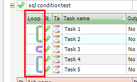

## Loop Functionality

### Summary

“Loops” are introduced in VisualCron version 6.0.0. Loops let you run several Tasks multiple times in three loop types:
1. For
2. For Each
3. While
 
During a loop you are able to access loop runtime Variables. For example, where you are in the current iteration and all related values.
 
### Architecture
Loops are objects that are stored in a Job. On Job can contain a maximum number of loops equal to the maximum number of Tasks. Loops are defined by a start Task and end Task. Anything in between will be looped in Task order. Loops cannot cross each other - you cannot create a loop in a loop.
 
Task Conditions are checked each time before a Task is run, independent of if Task is in loop or not.
 
### Loop types

There are three different loop types:

*For*

A loop type with and x and y value where x and y are numeric values.

*While*

A loop type that can compare two values according to a specific data type (i.e. string, integer)  and comparison method (i.e. larger        than, contains, equal).

*For each*

A loop type that iterates through an existing y value. A list of some sort.
 
### Working with loops
 
**Loop display**

If one or more Tasks belong to a loop you can see that in the loop column. You will see how the loop stretches over itself or more Tasks.

*Purple loop*: For loop

*Green loop*: While loop

*Blue loop*: For Each loop

**Add/Edit loop**

In the Task list, in main window or Task list of add/edit Job you can double click in the “Loop” column in each Task row. This will open up existing or new Loop settings window.

**Add loop option**

**Add loop > Main settings**

In the main settings you enter the descriptive name of the Loop. You also set which Task the loop should start and end with.

**Add loop > Loop settings**

In the loop settings you control the loop type by clicking on one of the three radio buttons.
You can click on the Variable button next to each text field to find and insert a Variable that can be used in the field.

**For x to y**

Enter two numerical values or Variables that contain numerical values.

 
**While x**

Depending on type comparison you enter different kind of values/Variables.

 
**For each x in y**

Enter a Variable that contains a list. You may need to alter field separator, text qualifier or line break depending on the format of the Variable list.

 
**Sleep/Wait in each iteration**

Sets the wait time between each iteration. This is especially interesting if you are using a While loop because you might want to save resources and not check _all_ the time.
 
**Limitations**

Set the maximum number of iterations. If your y value is less than 1000 then lower or keep value to prevent never ending loops.
 
**Add loop > Loop settings > Loop Variables**

Any Variable can be used in the settings of the actual loop to provide dynamic x and y values. Also, a set of dynamic, loop context sensitive Variables exist. You find them in the Variables browser:

**Loop Id**

Each loop in a Job has an internal Id.
 
**Loop name**

You are able to set a name of a loop which can be accessed through this Variable.
 
**Loop type**

If it is a For, For Each or While loop.
 
**Preset X value**

The original left hand value that you used in a For or While loop.
 
**Preset Y value**

The original right hand value in For, While or For Each loop.
 
**Current X value**

The value of the position in the loop. This value is interesting when using For or For Each loop.
 
**Current Y value**

The current value of the right hand value. Should be the same as Preset Y value in most scenarios.
 
**Current Y position in list**

A numeric value of the position in the y list. Used when using a For Each loop type.
 
**Y value list**

A list containing all rows in y.
 
**Id of Task that loops starts with**

Task Id for the selected start Task in the loop.
 
**Id of Task that loops ends with**

Task Id for the selected end Task in the loop.
 
**Column position that it used in For Each loop**

The numeric value of column position where x value is picked up.
 
**Field separator**

The character that is used to separate feilds in For Each loop.
 
**Text qualifier**

The surrounding character of each column.
 
**Line break**

The line break character that is used in each column.
 
**Number of loop iterations so far**

Number of loop “laps”/iterations that has been done so far.
 
**Maximum allowed iterations before exiting a loop**

A limit that prevents loop for going on forever. Default 1000. This value is showed here.
 
**Deleting a loop**

To delete a loop you open the Add/Edit Job window and go to Tasks tab. Right click/select a Task row that contains a loop and click on Delete loop. This will only delete the related loop - not the Tasks in it.

**Changing Task order**

A change of Task order (clicking up/down in the numeric box in the Task list) affects any existing loop.
 
If a loop covers 3 Tasks and the first Task is moved up it will include any Task that becomes number two in the list.
 
**Deleting Tasks**

If a start or end Task is deleted VisualCron will attempt to shift start or end Task, if loops covers more than one Task. If all Tasks that a loop covers are deleted the loop itself will be deleted.