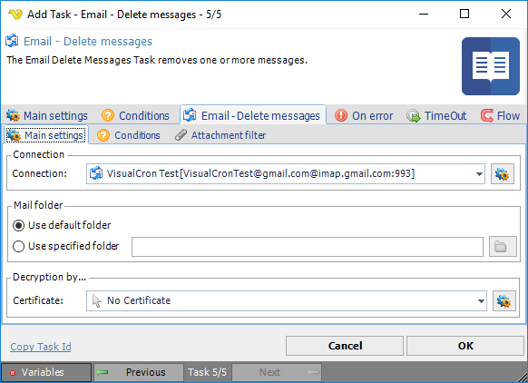

## Task Messaging - Email - Delete Messages

The Email Delete Messages Task removes one or more messages.
 
**Email - Delete messages > Main settings** sub tab

**Connection**

To use Email Tasks you need to create a [Connection](global-connections) first. Click the Settings icon to open the Manage Connections dialog.
 
**Mail folder**

If desired, change to Use specified folder and use manual folder specification or click the Folder icon.
 
**Decryption by**

If email decryption is used, enter certificate name.
 
**Email - Delete messages > Condition**s sub tab

See the [Task Messaging - Email - Get headers](job-tasks-messaging-tasks-task-messaging-email-get-headers) > **Email - Get headers > Conditions** sub tab
 
**Email - Delete messages > Attachment filter** sub tab

See the [Task Messaging - Email - Get headers](job-tasks-messaging-tasks-task-messaging-email-get-headers) > **Email - Get headers > Attachment filter** sub tab