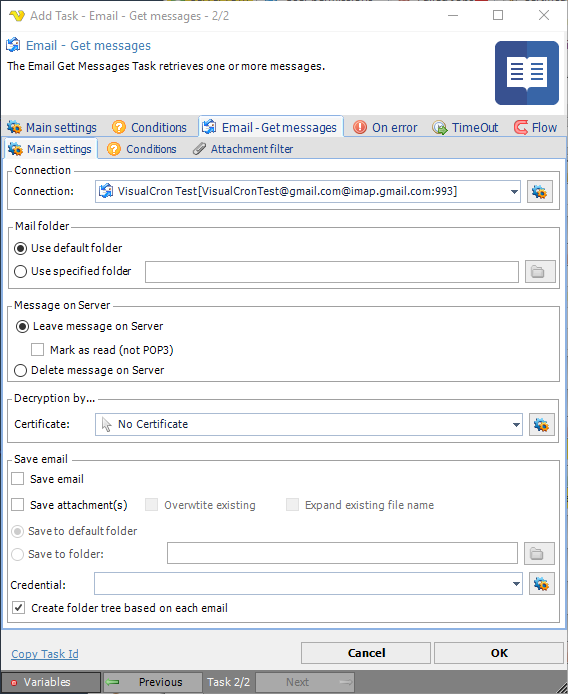

## Task Messaging - Email - Get Messages

The Email Get Messages Task retrieves one or more messages.
 
**Email - Get messages > Main settings** sub tab

**Connection**

To use Email Tasks you need to create a [Connection](global-connections) first. Click the Settings icon to open the Manage Connections dialog.
 
**Mail folder**

If desired, change to Use specified folder and use manual folder specification or click the Folder icon.
 
**Message on server**

If desired, change message on server options.
 
**Decryption by**

If email decryption is used, enter certificate name.
 
**Save email**

If desired, change save email options. For credential, click the Settings icon to open the Manage Credentials dialog.
 
**Email - Get messages > Conditions** sub tab

See the [Task Messaging - Email - Get headers](job-tasks-messaging-tasks-task-messaging-email-get-headers) > **Email - Get headers > Conditions** sub tab
 
**Email - Get messages > Attachment filter** sub tab

See the [Task Messaging - Email - Get headers](job-tasks-messaging-tasks-task-messaging-email-get-headers) > **Email - Get headers > Attachment filter** sub tab