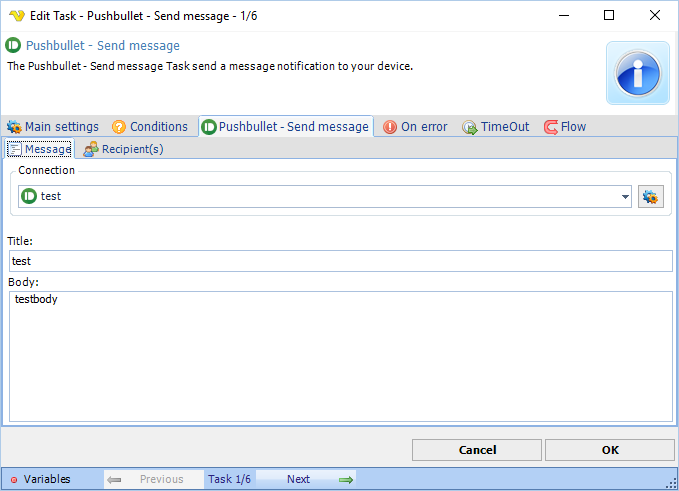
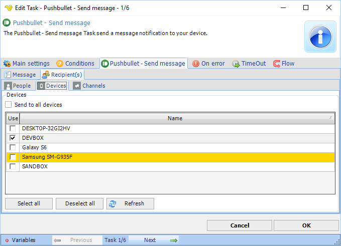

## Task Messaging - Pushbullet - Send Message

The Pushbullet - Send message Task allows you to send a message to any contact and/or your own device and/or channel.

**Connection**

Select an existing global [Pushbullet Connection](connection-pushbullet) for storing connection credentials.
 
**Title**

The notification title.
 
**Body**
The message of the notification.
 
**Pushbullet - Send Message > Recipients > Devices** sub tab

With Pushbullet you can send to a Contact, Device or a Channel. If you have selected a Connection these will refresh and you will be able to select on or more recipients.
