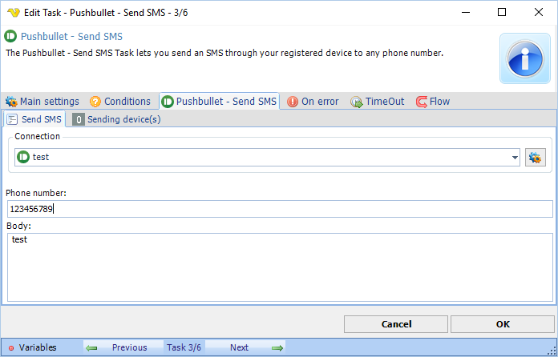
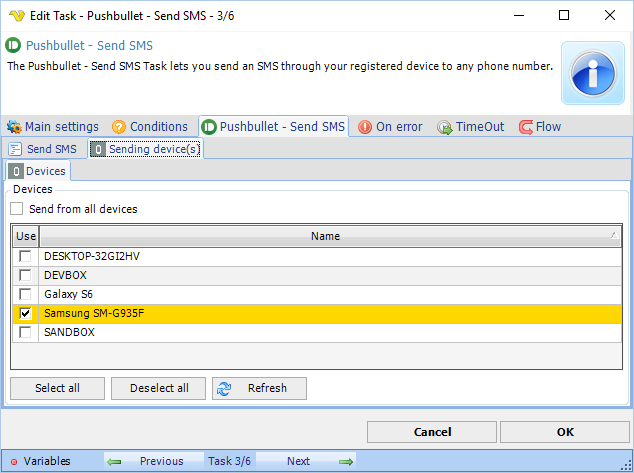

## Task Messaging - Pushbullet - Send SMS

The Pushbullet - Send SMS Task lets you to send an SMS through your registered device to any phone number. A device could be a phone that you have linked to Pushbullet services.

**Connection**

Select an existing global [Pushbullet Connection](connection-pushbullet) for storing connection credentials.
 
**Phone number**

The recipient phone number.
 

**Body**

The message of the SMS.

**Pushbullet - Send SMS > Sending device(s) > Devices** sub tab

**Devices**

Select a phone (among the devices) that will send the SMS.