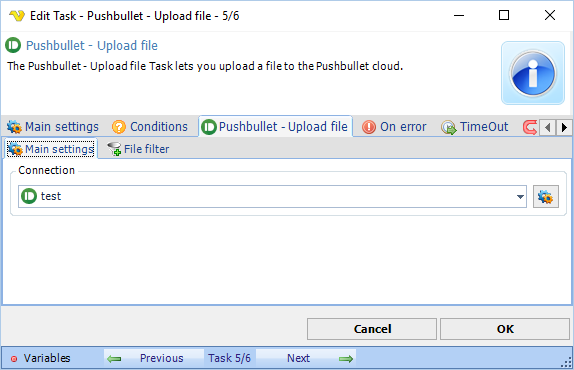

## Task Messaging - Pushbullet - Upload File

The Pushbullet - Upload file Task allows you to upload one or more files to the Pushbullet cloud repository. This Task will return the URL to the uploaded file.

**Connection**

Select an existing global [Pushbullet Connection](connection-pushbullet) for storing connection credentials.
 
**Pushbullet - Upload file > File filter** sub tab

Use the standard [File filter](job-tasks-file-filter) to select one or more files to upload.