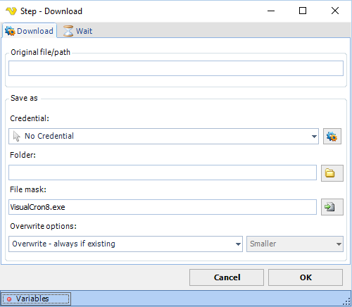

## Download Step

The Download step is triggered automatically when a web page presents something for download - this could be initiated originally by a click.

**Original file path**

This field is filled later and contains the source file.
 
**Credential**

If you need to save the file on a network resource you probably need a Credential to elevate the rights. Use an existing or add [one](global-credentials).
 
**Folder**

This is the destination folder.
 
**File mask**

This is the destination file mask / file name.
 
**Overwrite options**

Control what happens if the file already exists with these settings.
 
**Wait tab**

The wait tab controls how long time the step should wait before performing the step and after performing the step (in milliseconds).