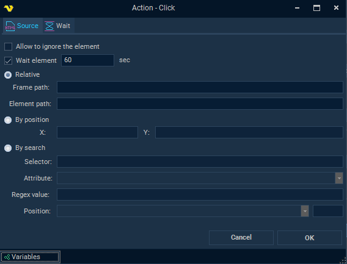
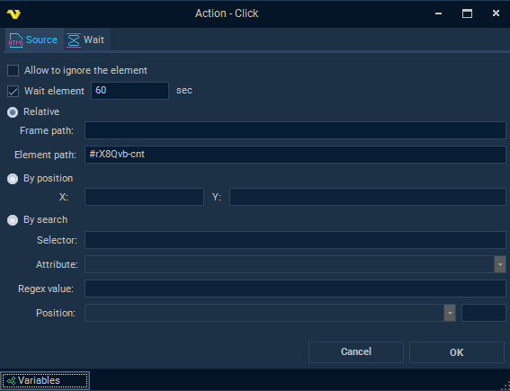
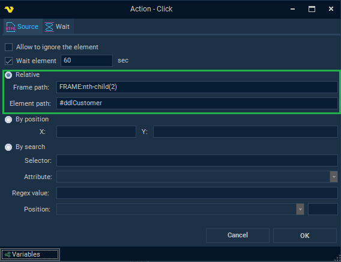
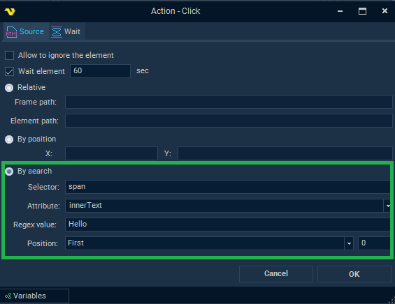
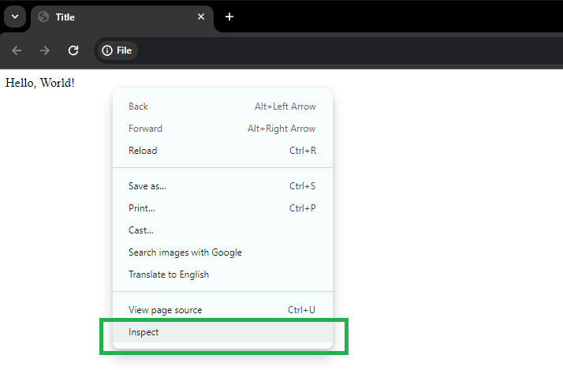
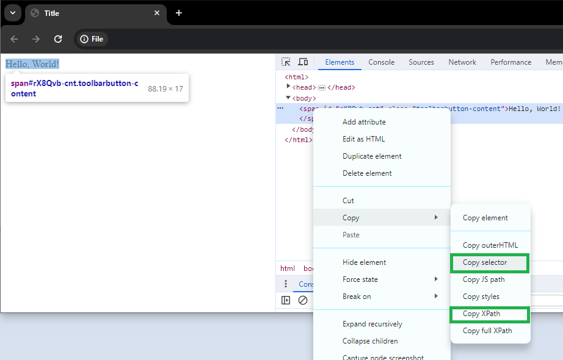

## Element Path

The settings forms for many activities in the Web macro Task include a tab for specifying the path to HTML element. There are three ways to specify the path to the element:
 
* Relative
* By position
* By search



### Relative mode
 
**Element path** is a field that specifies the path to the element to be detected. It is possible to use a **CSS selector** or an XPath expression as the path to the Element. It is enough to specify only a **CSS selector** in this field, but the full format of this path string is
 
```pathCss[%]pathHtml[%]pathXPath```
 
* **pathCss** is a CSS selector
* **pathHtml** is an additional internal format for representing the path to the Element
* **pathXPath** is a XPath expression
* [**%]** is a separator



Full path format is used in recording mode for increased dependability. When configuring activities manually, the path does not need to be specified in its entirety. This path to the Element is split by the separator [%] during activity processing. The Element is first searched by the third part (**pathXPath**) if it exists after the split. If the Element was not found using XPath, then the element is searched using the second part (**pathHtml**). Finally, if the Element is still not found, the search will be using the CSS selector (pathCss). If the **[%]** separator is not specified, the path is interpreted as a **CSS selector**. To find an element using **XPath**, the Element path should be provided after two separators [%]. For example:
 
[%][%]/HTML/BODY/APP-ROOT[1]/DIV[2]/APP-RPA1[1]/DIV[1]/DIV[2]/FORM[1]/INPUT[1]
 
CSS selector examples

```html

<html>
 <head>
         <title>Title</title>
 </head>
 <body>
         <span id="rX8Qvb-cnt" class="toolbarbutton-content">Hello, World!</span>
 </body>
</html>

``` 

In the **html** example above there is a span element. Examples of different **CSS selectors** to find this span element:
 
Class selector:

.toolbarbutton-content

ID selector:

#rX8Qvb-cnt

Type selector:

span

Attribute selector:

span[id="rX8Qvb-cnt"]

Child selector:

html > body > span

 
Some examples of element path using **XPath**:

[%][%]//*[@id="rX8Qvb-cnt"]

[%][%]/HTML/BODY/SPAN[1]

[%][%]//span[contains(., "Hello")]
 
Frame path is a field that specifies the path to the html tag Frame, where the path is represented as a valid CSS selector string. In most cases this field is optional. This field is only filled if the web page uses HTML frames (when the HTML web page contains a ```<frame>``` tag).



### By position
 
Mode for locating an element by coordinates on the page. Currently out of date, upgrades are planned.
 
 
### By search
 
This mode is based on searching for elements using a **CSS selector** (**"Selector"** field), which is passed to the JavaScript function **querySelectorAll**. The first step is to define a list of HTML elements that match the **CSS selector**. Then the resulting list of elements is filtered: the value of the specified element attribute (or element property **innerHTML**, **outerHTML**, **innerText**, **outerText**) is matched using a regular expression (**"Regex value"** field). Finally, the searched element is determined by the ordinal position specified in the settings (**"Position"** field).



### Additional notes
 
When manually setting click activity settings, the fastest way to determine the correct CSS selector or XPath expression is to use the web browser's Inspector mode. Below is an example of using the Google Chrome browser to inspect HTML elements. Some selectors include quotes, it is important to make sure that in paths they are specified as double quotes and not single quotes.





