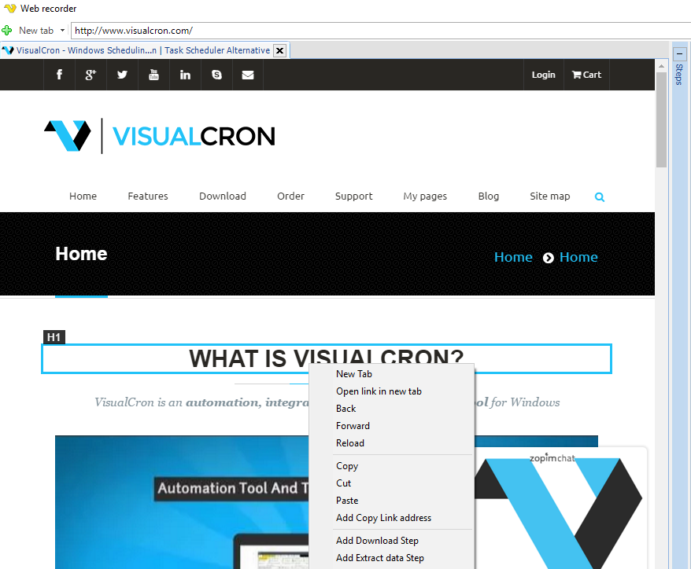
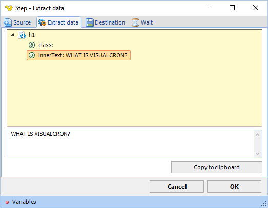
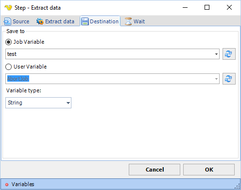

## Extract Data Step

The extract data steps extracts an attribute of a page element. This attribute can be stored in either local Job Variable or global User Variable.
 
To extract a certain attribute you right click on it and chose Add Extract data step below:

Then select the attribute you want to extract below:

Then set where you want to save the attribute value (in which Variable):

**Wait tab**

The wait tab controls how long time the step should wait before performing the step and after performing the step (in milliseconds).

