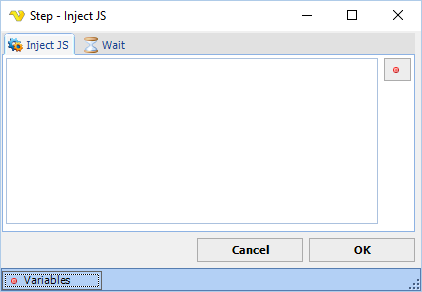

## Inject JS Step

The Inject JS step lets you send javascript code for execution on the current page.

**Wait tab**

The wait tab controls how long time the step should wait before performing the step and after performing the step (in milliseconds).