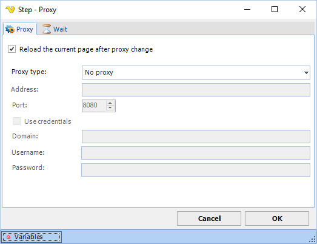

## Proxy Step

The Proxy step lets you change the proxy being used during run time. It overrides any previous set proxy in the Task.

**Reload the current page after proxy change**

If you do check this the the current page will not be affected.
 
**Wait tab**

The wait tab controls how long time the step should wait before performing the step and after performing the step (in milliseconds).