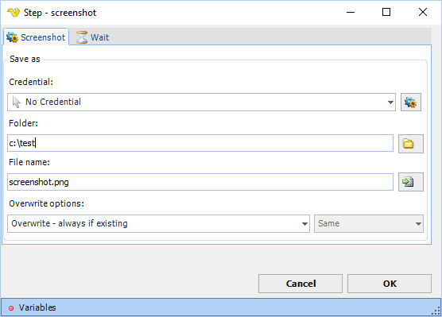

## Screenshot Step

The Screenshot step takes a screenshot of the current webbrowser and saves it to a file.

**Wait tab**

The wait tab controls how long time the step should wait before performing the step and after performing the step (in milliseconds).