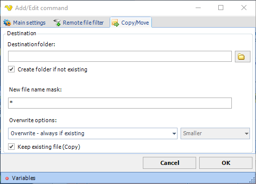

## Command - Copy/Move Files

The Copy/Move command copies or moves one file on the remote server to another folder on the remote server.
 
This command uses the [Remote file filter](job-tasks-remote-file-filter) to identify files to move or copy.
 
**Copy/Move** sub tab

**Destination folder**

The folder which the file(s) should be moved/copied to.
 
**Create folder if not existing**

If this is checked the destination folder will be created if not existing.
 
**New file name mask**

The name that the file should have when entering the destination folder. Use * for keeping the original name.
 
**Overwrite options**

Optionally you can choose to copy/move only depending on file properties on the destination file (if it exists).
 
**Keep existing file**

If this property is checked the original file will be copied to the destination file and the original file will be kept. Otherwise, a move/rename will occur.