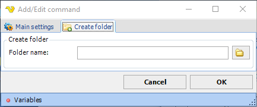

## Command - Create Folder

The Create folder command creates a folder on the remote server.
 
**Create folder** sub tab

**Folder name**

Specify the folder name to be created. If the server supports it you can specify a relative path; /folder/subfolder. If not, you first have to use the change folder command (if you are not already in that folder).

