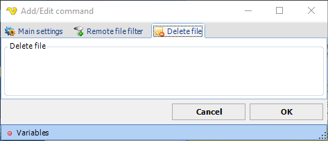

## Command - Delete Files

For delete files, VisualCron uses the [remote file filter](job-tasks-remote-file-filter) to specify files that should be deleted.
 
**Delete file** sub tab

**Delete File**

Text...