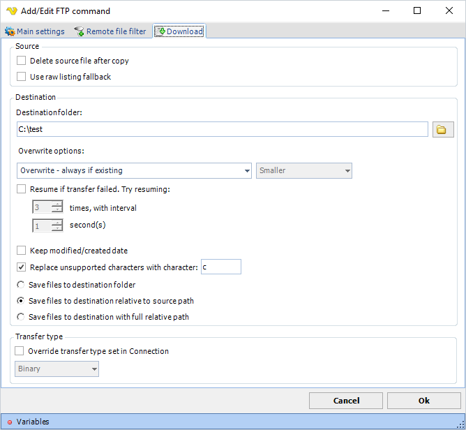

## Command - Download File(s)

The download command is able to receive one or more files recursively if needed.
 
For download, VisualCron uses the [remote file filter](job-tasks-remote-file-filter) to specify files that should be downloaded.
 
**Download** sub tab



**Delete source file after copy**

Deletes the original file on the ftp after it has been downloaded.
 
**Use raw listing fallback**

Some old *nix servers have problems with the LIST command. You can try this function if download fails.
 
**Destination folder**

The local folder (or network drive) where you want store the file(s). Use credentials if you want store files on a network drive.
 
**Overwrite options**

* *Overwrite - always if existing*: if destination file already exists it will be overwritten
* *Overwrite - if newer*: if the source file is newer than the destination file the destination file will be overwritten
* *Overwrite - if destination size is -:* with this option you can overwrite a file depending on destination file size compared to the original file size on the ftp
* *Do not overwrite if existing*: VisualCron does not overwrite the existing file if it already exists
* *Append if destination i smaller - otherwise overwrite*: writes bytes to existing data until size is the same as source - if not smaller then a overwrite will done
* *Append if destination i smaller - otherwise overwrite if newer*: writes bytes to existing data until size is the same as source - if not smaller then a overwrite will done if source file is newer than destination file
* *Append if destination i smaller - otherwise skip*:  writes bytes to existing data until size is the same as source - if not the file will not be sent
 
**Resume if transfer failed**

Will append to the file if something fails during transfer. The second interval will be used as a pause between each retry. Specify number of retries it will do before finally giving up.
 
**Keep modified/created date**

This option will set the same modified and creation date as the on the ftp.
 
**Save files to destination folder**

This option saves all files (including files in sub folders if Include sub folders are checked) in the root of the destination folder.
 
**Save files to destination relative to source path**
This option will create sub folders (if existing) relative to the Source folder in remote file filter. For example, if source is ```/ftp/download```, destination is c:\test and files reside in /```ftp/download/subfolder``` the folder ```c:\test\subfolder``` will be created for the file.
 
**Save files to destination with full relative path**

This option will create sub folders (if existing)  by appending the current path to the destination path. For example, if source is /ftp/download, destination is c:\test and files reside in ```/ftp/download/subfolder``` the folder ```c:\test\ftp\download\subfolder``` will be created for the file.
 
**Replace unsupported characters with character**

If checked, VisualCron will replace any character that is not supported in Windows file system with the specified character.
 
**Transfer type**

Original transfer type settings are stored in the [Connection](global-connections). It is possible to override this setting for this specific command.