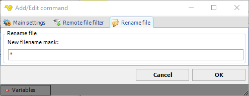

## Command - Rename Files

The Rename file command renames one or more files on the remote server.
 
For rename files, VisualCron uses the [remote file filter](job-tasks-remote-file-filter) to specify files that should be renamed.
 
**Rename file** sub tab

**New name**

The new relative file name.