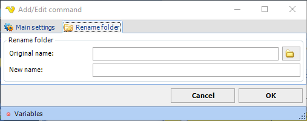

## Command - Rename Folder

The Rename folder command renames a folder on the remote server.
 
**Rename folder** sub tab

**Original name**

The original relative folder name.
 
**New name**

The new relative folder name.