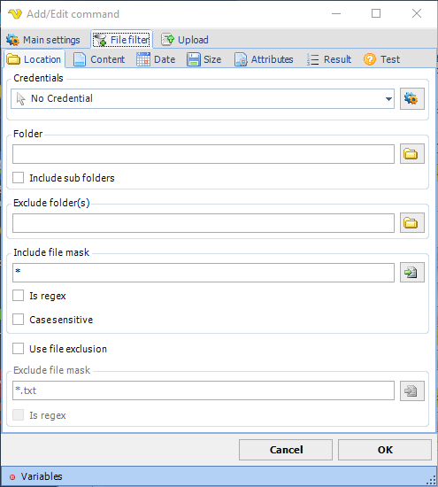
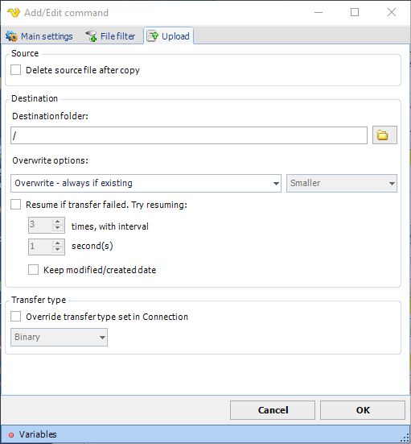

## Command - Upload File(s)

The upload command sends one or more files and creates recursive folders if necessary.
 
**Upload > File filter** sub tab

For upload, VisualCron uses the standard [file filter](job-tasks-file-filter) to specify files that should be uploaded.
 
**Upload** sub tab

**Delete source file after copy**

Deletes the local file after being uploaded.
 
**Destination folder**

Enter the folder name where the files are to be sent. If your server supports relative paths, you could specify a destination folder in this way: /topfolder/subfolder
 
**Overwrite options**

* *Overwrite - always if existing*: if destination file already exists it will be overwritten
* *Overwrite - if newer*: if the source file is newer than the destination file the destination file will be overwritten
* *Overwrite - if destination size is -*: with this option you can overwrite a file depending on destination file size compared to the original file size on the ftp
* *Do not overwrite if existing* - VisualCron does not overwrite the existing file if it already exists
* *Append if destination is smaller - otherwise overwrite*: writes bytes to existing data until size is the same as source - if not smaller then a overwrite will done
* *Append if destination is smaller - otherwise overwrite if newer*: writes bytes to existing data until size is the same as source - if not smaller then a overwrite will done if source file is newer than destination file
* *Append if destination is smaller - otherwise skip*:  writes bytes to existing data until size is the same as source - if not the file will not be sent
 
**Resume if transfer failed**

Will append to the file if something fails during transfer. The second interval will be used as a pause between each retry. Specify number of retries it will do before finally giving up.
 
**Transfer type**

Original transfer type settings are stored in the [Connection](global-connections). It is possible to override this setting for this specific command.