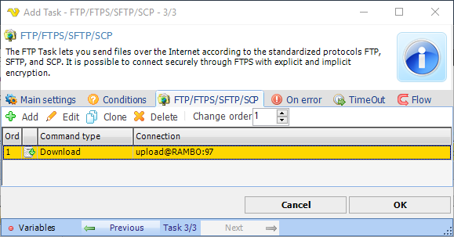
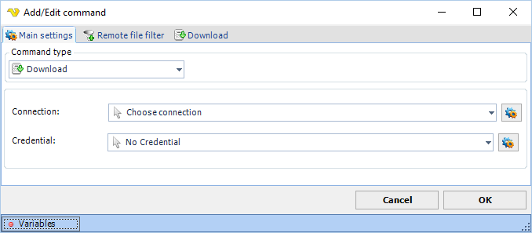

## Task Net - FTP/FTPS/SFTP/SCP

The FTP Task lets you send files over the Internet according to the standardized FTP protocol, SCP and SFTP using the SSH protocol. It is possible to connect securely through FTPS with explicit and implicit encryption. The FTP/SCP/SFTPS Task uses the [FTP/SCP/SFTP Connection](ftp-connection) for configuring how to connect to the remote server.
 
In VisualCron, the connection properties are separated from the FTP Task properties to give advantages such as re-use of connections.
 
To add a FTP Task, you select Task type "FTP/FTPS/SFTP/SCP" from the combo box in the *Add/Edit Task -> Main settings* tab and enter a name for the Task and specific data for the Task.
 
In the *FTP/FTPS/SFTP/SCP* tab, all the defined FTP commands that are associated with this Task are listed. These FTP commands are run in the list order. You can change the order by marking a row and click on the numeric up/down button. When different commands use different Connections, it is recommended that you run the commands with the same connection in order. Thus, VisualCron does not have to disconnect between commands which else will slow down the Task.

Click on *FTP/FTPS/SFTP -> Add* button to add a new FTP command in the *Add/Edit FTP command* window.

**Command type**

Select the appropriate FTP command.
 
The following commands exists currently:

* [Upload file(s)](job-tasks-net-tasks-task-net-command-upload-files)
* [Download file(s)](job-tasks-net-tasks-task-net-command-download-files)
* [Rename file(s)](job-tasks-net-tasks-task-net-command-rename-files)
* [Copy/Move file(s)](job-tasks-net-tasks-task-net-command-copy-move-files)
* [List files](job-tasks-net-tasks-task-net-command-list-files)
* [Delete file(s)](job-tasks-net-tasks-task-net-command-delete-files)
* [Create folder](job-tasks-net-tasks-task-net-command-create-folder)
* [Delete folder(s)](job-tasks-net-tasks-task-net-command-delete-folders)
* [Change folder](job-tasks-net-tasks-task-net-command-change-folder)
* [Rename folder](job-tasks-net-tasks-task-net-command-rename-folder)
* [Custom command](job-tasks-net-tasks-task-net-command-custom-command)
 
:::tip Note 1 

The *Custom command* method does not support custom commands that require a data connection such as 
STOR (Upload), RETR (Download), NLST and LIST (GetFolderContents), etc.

:::

:::tip Note 2

This command type is not available for SFTP protocol type.

:::

**Connection**

Click on the *Manage connections* button to add/edit existing connections. Select a connection once you have configured it.
 
**Credential**

Credentials could be needed if you want to upload or download files to or from a network drive. Click on the Manage credentials button to add a new credential. Be sure to specify a UNC path to the file/folder when uploading/downloading (\\servername\folder\file)