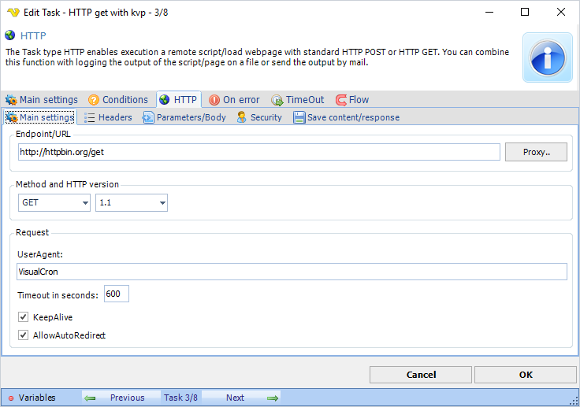
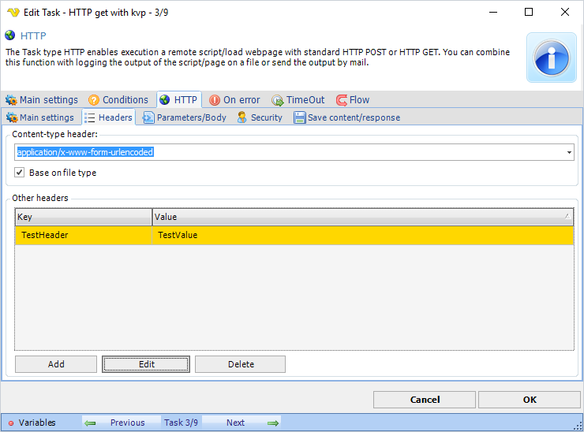
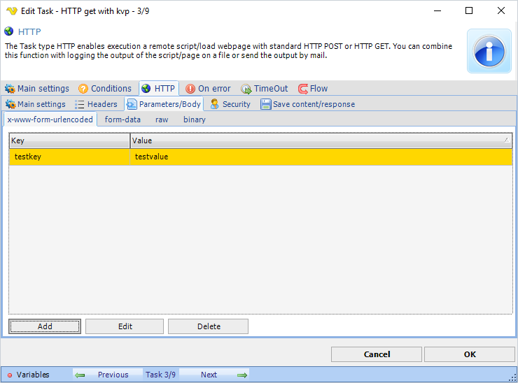
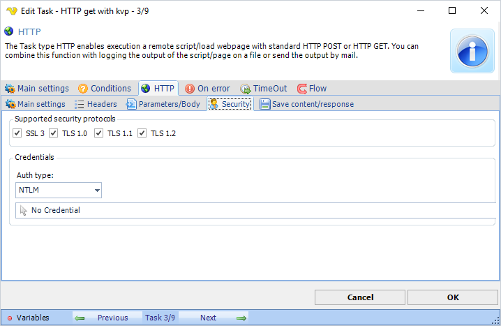
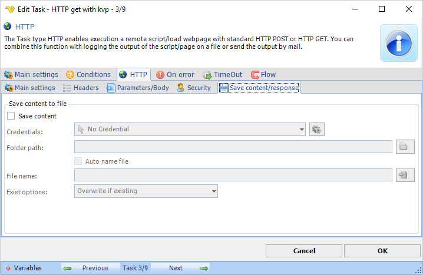

## Task Net - HTTP

The Task type HTTP enables execution a remote script/load webpage with standard HTTP POST or HTTP GET. You can combine this function with logging the output of the script/page on a file or send the output by mail.
 
**HTTP > Main settings** tab



**Endpoint/URL**

This is the remote script or page to be called. Use the following format: [http://www.yourwebpage.com/yourscript.php](http://www.yourwebpage.com/yourscript.php). If you use a GET you can either add parameters like ```?mykey1=myvalue1&mykey2=myvalue2``` or use the Parameters/Body tab to input parameters. If you use POST you should only use the Parameters/Body tab.
 
**Proxy..**

Select if you want to use a proxy.
 
**Method**

There are two kinds of methods which are most common when calling a remote script or page. Some web frameworks (such as PHP) provide separate mechanisms for accessing POST and GET data. POST is generally recommended because URL:s don't appear in web logs.
 
**Version**

Select which HTTP version to use. Default 1.1.
 
**UserAgent**

Optional. If your script requires a certain UserAgent you can use this field to let VisualCron pretend to be a certain UserAgent.
 
**Timeout in seconds**

This is the timeout of the web request. Default is 600 seconds.
 
**KeepAlive**

Set this property to true to send a Connection HTTP header with the value Keep-alive. An application uses KeepAlive to indicate a preference for persistent connections. When the KeepAlive property is true, the application makes persistent connections to the servers that support them.

:::warning

When using HTTP/1.1, Keep-Alive is on by default. Setting KeepAlive to false may result in sending a Connection: Close header to the server.
 
:::

**AllowAutoRedirect**

Set AllowAutoRedirect to true if you want the request to automatically follow HTTP redirection headers to the new location of the resource.
 
**Expect 100 Continue**
Enable this if you get HTTP error 417.
 
**HTTP > Headers** tab



**Content-type header**

This header controls the content type of the HTTP request. In the drop down most common headers can be found. This setting is also related to the Parameters/Body tab as it affects the way the body is posted.
 
**Other headers**

Custom headers can also be added by pressing Add button.
 
**HTTP > Parameters/Body** tab



**Parameters/body**

Depending on content-type header you can POST various content in the body. By selecting a tab you choose how the body is sent - please note that you need to set a matching content-header as well. Different body options:
 
**x-www-form-urlencoded** - use this for simple key/value pairs

**form-data** - use this if form-data content-type header required and if you want to POST multi-part data like files (and maybe text).

**raw** - use this for sending body text raw - for example when sending a Json request

**binary** - use this for sending a stream of binary data like one file
 
**HTTP > Security** tab



**Supported security protocols**

Set the supported security protocols (by your web server) to use the maximum security.
 
**Credentials**

Optional. If your script requires authentication you can select a credential from the combo box. By clicking on Manage credentials you can add or edit current credentials.
 
**Auth type**

What kind of authentication method that is used. No authentication method is used if no Credential is selected. By default NTLM auth type is used.
 
**HTTP > Save content/response** tab



**Save content**

Normally, the content from the request is stored in the HTTP output. For example, if you script returns a text it can be found the Result of the HTTP Task. It is stored in text mode. If you want to use the binary output, for example if you want to download a file, you should check Save content.
 
**Credentials**

Optional. If you want to save the content in a folder which requires network credentials then select a valid credential for that folder. By clicking on Manage credentials you can add or edit current credentials.
 
**Folder path**

Specify a path where you want to save the content/file.
 
**Auto name file**

Optional. If this box is checked your file will be named after the the last part of the url.
 
**File name**

The name of the file to be saved.
 
**Exist options**

Select how VisualCron should handle existing files. Append, overwrite, overwrite if newer or skip the saving.
 
### Troubleshooting:

**Error "The requested security protocol is not supported."**

Try unchecking protocols in Supported security protocols. Start with disabling TLS1.1 and TLS1.2.