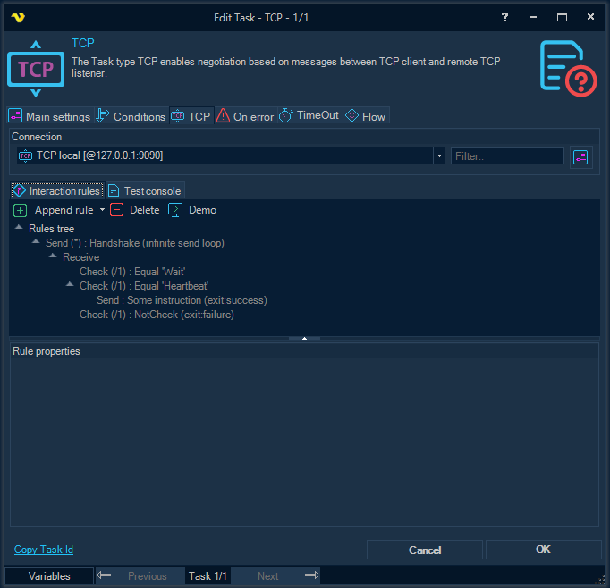
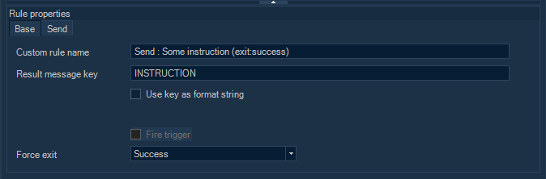
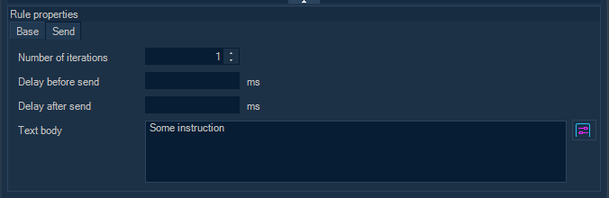
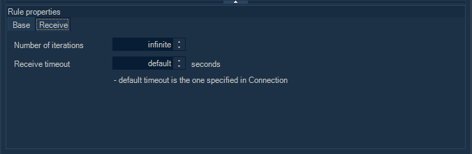
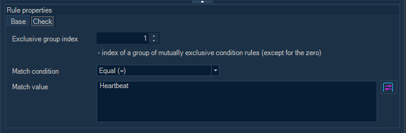
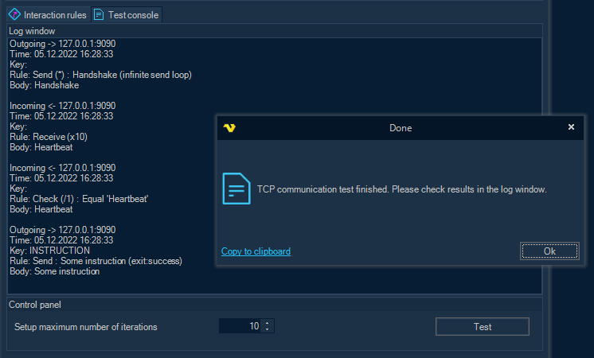

## Task Net - TCP

The Task type TCP creates a TCP client which then connects to a remote TCP listener. If the connection is successfully established, the client communicates with the server based on the logic configured using some messaging rules.
 
**TCP > Connection** group and I**nteraction rules** inner tab



**Connection**

Before configuring any interaction rules you must create a Connection. Click on Manage Connections to add a new Connection. Select TCP connection and alter connection settings.
 
**Interaction rules** tab

The tab contains a toolbar with commands to configure a tree-like structure, which, in turn, is used for setting up the messaging logic between the TCP server (listener) and the TCP client (see “[TCP messaging rules](#tcp-messaging-rules)” below).
 
Available commands:

*Append rule*: append a rule of some type (send a message, receive a message, or check the received message body).
*Delete*: delete a rule with all child rules.
*Demo*: automatically create a set of rules with an example of a simple communication algorithm between a client and a server.
 
#### TCP messaging rules

Messaging rules are used to set up communication logic between the TCP server (listener) and the TCP client. The same rules are used in both the TCP Trigger and the TCP Task. The only difference is that in the case of the TCP Trigger, a checkbox “*Fire trigger*” is available (see below).
 
There are three types of rules:

* Send rule, used to send a message;
* Receive rule, used to receive a message;
* Check rule, used to check some condition regarding the message from the parent rule.
 
All rules are organized in a tree-like structure. This can be very useful when it needs to run different scenarios depending on the content of an incoming (or outgoing) message. Listed below are all of the rule properties that can be configured.
 
**Base** rule properties (for all types of rules)



**Custom rule name**

Optional user specified rule name. Stored encrypted. If not specified, the rule name is generated automatically.
 
**Result message key**

Optional unique outgoing message key. If specified, the processed message is added to the result list; only the last message with the same key is persisted in the result list.
 
**Use key as format string**

If the flag is set, the value of “Result message key” property is used as the format string for the current result message number to create the final key.
For example, a value of "D2" will cause outgoing messages to automatically receive a message key value of "01", then "02", and so on.
 
**Fire trigger**

Causes the TCP Trigger to fire with the current message; a list of result messages is cleared after triggering.
 
**Force exit**

Forces the negotiation to stop and closes the TCP connection after processing the current rule, including existing child rules. Might be useful in scenarios with infinite loops.
 
**Send** rule properties



**Number of iterations**

The number of times the same rule (including existing child rules) is processed before moving on to the next rule at the same level of the rules hierarchy. A value of “-1” means repeat indefinitely.
 
**Text body**

A message content to send. Stored encrypted, supports variable templates.
 
**Delay before send (ms)**

Optional delay before sending a message, in milliseconds.
 
**Delay after send (ms)**

Optional delay after sending a message, in milliseconds.
 
**Receive** rule properties



**Number of iterations**

The number of times the same rule (including existing child rules), is processed before moving on to the next rule at the same level of the rules hierarchy. A value of “-1” means repeat indefinitely.
 
**Receive timeout (seconds)**

An incoming message timeout. A value of “-1” (default) - use timeout specified in the TCP Connection. A value of “0” - wait indefinitely until socket closes.
 
**Check** rule properties



**Exclusive group index**

An optional index of a group of mutually exclusive condition rules (except for the zero).
If one rule in the group is processed, other rules are automatically skipped.
Each group is formed from the rules that are in the same list of child nodes in the rules tree.
 
**Match condition**

The type of checking the message content for compliance with the value of “Match value” property.
 
**Match value**

The value to be checked against the message content.
 
**TCP > Test console** inner tab



You are able to test the configured messaging rules without saving the settings.
As a remote TCP server (listener), a similar test scenario can be launched in the [TCP Trigger](tcp-trigger) UI form, or a test application can be compiled and launched (see sample TCP Listener application code below).
 
**Setup maximum number of iterations**

All rules with a large or infinite number of repetitions automatically terminate after the specified maximum number of iterations.
 
### TCP Task Result Variables
 
**Messages**

A list of processed messages in the form { Key, TextBody }, so that the text of a particular message is available by specifying Key in a variable template.
 
**Sample TCP Listener application code (C#)**

```csharp

using System.Net;
using System.Net.Sockets;
using System.Text;
 
namespace TCP_Listener
{
  internal class Program
   {
      static void Main()
       {
           TcpListener tcpListener = null;
          try
           {
              /*
                * Start listening
                */
               Console.WriteLine("Starting listener .....");
               tcpListener = new TcpListener(new IPEndPoint(IPAddress.Parse("127.0.0.1"), 9090));
               tcpListener.Start();
               Console.WriteLine("Listener started");
 
              /*
                * Wait for TCP client
                */
               Console.WriteLine("Waiting for connection .....");
              using var tcpclnt = tcpListener.AcceptTcpClient();
              using var stm = tcpclnt.GetStream();
               Console.WriteLine("Client connected");
 
              /*
                * WARNING:
                *   the encoding should be the same as configured in the TCP Connection / Common settings / Code page
                */
              var enc = Encoding.UTF8;
              string message;
              byte[] buffer;
 
              /*
                * Receiving an initial handshake message
                */
               Console.WriteLine();
               Console.WriteLine("Receiving an initial message .....");
               Thread.Sleep(1000);
 
               buffer = new byte[tcpclnt.ReceiveBufferSize];
              var cnt = stm.Read(buffer, 0, buffer.Length);
 
               message = enc.GetString(buffer, 0, cnt);
               Console.WriteLine("Message received : " + message);
 
              /*
                * Checking the handshake message
                */
              const string handshake_request = "Handshake";
              if (message == handshake_request)
               {
                   Console.WriteLine("Handshake request checked.");
                   Thread.Sleep(1000);
               }
              else
               {
                   Console.WriteLine($"The request is invalid. Must be '{handshake_request}'");
                  return;
               }
 
              /*
                * Sending "Heartbeat"
                */
               message = "Heartbeat";
               Console.WriteLine();
               Console.WriteLine($"Sending '{message}' .....");
               buffer = enc.GetBytes(message);
               stm.Write(buffer, 0, buffer.Length);
 
               Console.WriteLine($"'{message}' sent");
               Thread.Sleep(1000);
 
              /*
                * Receiving some instruction
                */
               Console.WriteLine();
               Console.WriteLine("Receiving an instruction .....");
               buffer = new byte[tcpclnt.ReceiveBufferSize];
               cnt = stm.Read(buffer, 0, buffer.Length);
 
               message = enc.GetString(buffer, 0, cnt);
               Console.WriteLine("Instruction received : " + message);
           }
          finally
           {
               tcpListener?.Stop();
               Console.WriteLine("Exit.");
           }
       }
   }
}

```