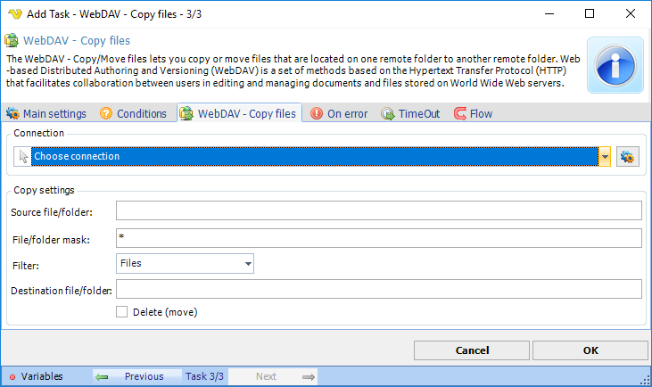

## Task Net - WebDAV - Copy Files

The WebDAV - Copy/Move files lets you copy or move files that are located on one remote folder to another remote folder. Web-based Distributed Authoring and Versioning (WebDAV) is a set of methods based on the Hypertext Transfer Protocol (HTTP) that facilitates collaboration between users in editing and managing documents and files stored on World Wide Web servers.

**Connection**

All WebDAV Task uses connection settings from a Connection. In Connections you can create a new WebDAV connection with all other details like Proxy. In the combo box you select the Connection after creation.
 
**Source file/folder**

The full url to a file or folder you want to copy or move.
 
**File/folder mask**

This field is able to use either the exact name of a file or folder you want to copy/move or a combination with wild cards to find one or more files.
 
**Filter**

The filter decides what to copy/move. If you specify "Files" it will only use the *File/Folder mask* to find files.
 
**Destination file/folder**

The full url to a file or folder you want to copy or move to.
 
**Delete**

If checked, a "Move" operation will be done - otherwise copy (keep original file).

