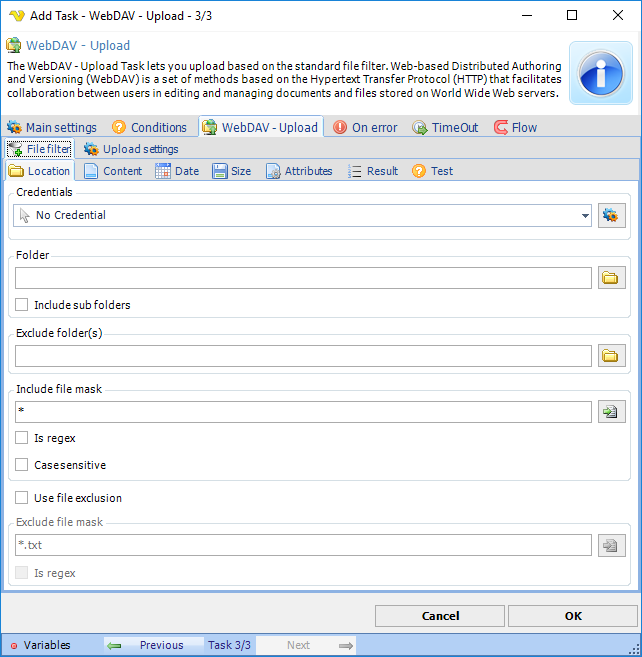
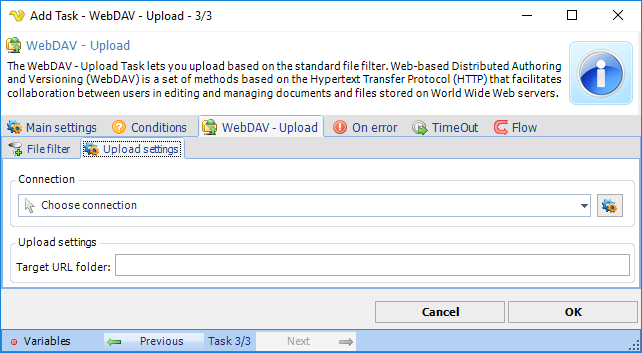

## Task Net - WebDAV - Upload

The WebDAV - Download Task lets you upload documents based on a file filter. Web-based Distributed Authoring and Versioning (WebDAV) is a set of methods based on the Hypertext Transfer Protocol (HTTP) that facilitates collaboration between users in editing and managing documents and files stored on World Wide Web servers.

The WebDAV - Upload Task lets you upload based on the [standard file filter](job-tasks-file-filter).
 
**WebDAV Upload > Upload settings** tab

**Connection**

All WebDAV Task uses connection settings from a Connection. In Connections you can create a new WebDAV connection with all other details like Proxy. In the combo box you select the Connection after creation.
 
**Target URL Folder**

This is the remote folder you want to upload to.