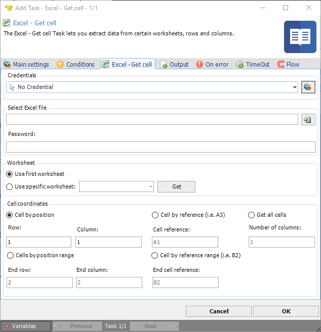

## Task Office - Excel - Get Cell

The Excel - Get cell Task lets you extract data from certain worksheets, rows and colums.

**Credentials**

To control a remote computer you may need to use a Credential. The Credential must match the user name and password of the user that you want to login for. Select a Credential in the combo box or click the *Settings* icon to open *Manage credentials* in order to add or edit Credentials.
 
**Select Excel file**

Select full path to the Excel file.
 
**Worksheet**

Select which worksheet in the workbook to access. Press the Get button to populate the list of existing worksheets.
 
**Cell coordinates**

The options for output of cell content.

Select *Cell* by position or Cell by reference if you want a single cell result.
Select *Cells* by position range if you want to obtain a *Row* to *End row* and *Column* to *End column* result.
Select *Cell* by *reference range* if you want to obtain a C*ell reference* to *End cell* reference result.
Select *Get all cells* if you want a result for a number of columns.

